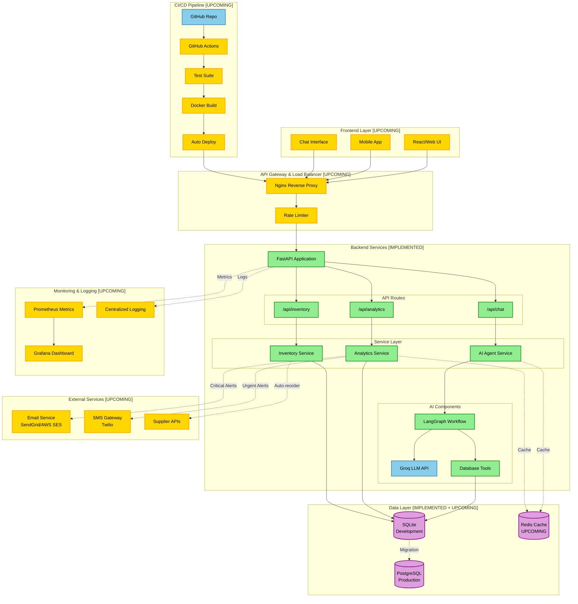

# Smart Inventory Assistant

An AI-powered inventory management system for healthcare supply chains. Built with FastAPI, SQLAlchemy, and LangChain for intelligent inventory insights and natural language queries.

## Overview

Smart Inventory Assistant helps hospital administrators manage medicine inventory across multiple locations by:
- **Real-time stock monitoring** across 8 healthcare locations
- **AI-powered chatbot** for natural language inventory queries
- **Automated alerts** for critical and warning stock levels
- **Predictive analytics** with reorder recommendations
- **Visual heatmaps** for quick status overview

## Tech Stack

- **Backend**: FastAPI 0.104.1, SQLAlchemy 2.0.23, Pydantic 2.5.0
- **Database**: SQLite with 60 days of historical data
- **AI/ML**: LangChain, LangGraph, Groq API (Llama-3.1-70b)
- **Deployment**: Docker (placeholder), Uvicorn
- **Configuration**: python-dotenv

## Project Structure

```
smart-invantory-assistant/
├── backend/
│   └── app/
│       ├── main.py                    # FastAPI entry point
│       ├── config.py                  # Environment configuration
│       ├── api/
│       │   └── routes/
│       │       ├── analytics.py       # Analytics endpoints
│       │       ├── chat.py            # Chatbot endpoints
│       │       └── inventory.py       # CRUD endpoints
│       ├── database/
│       │   ├── connection.py          # SQLite engine/session
│       │   ├── models.py              # ORM models
│       │   └── queries.py             # Stock health queries
│       ├── services/
│       │   ├── analytics_service.py   # Analytics business logic
│       │   ├── inventory_service.py   # Transaction management
│       │   └── ai_agent/
│       │       ├── agent.py           # LangGraph agent
│       │       ├── tools.py           # Database query tools
│       │       └── prompts.py         # System prompts
│       └── utils/
│           └── calculations.py        # Utility functions
├── database/
│   ├── schema.sql                     # Database schema
│   ├── seed_data.py                   # 60 days sample data generator
│   └── smart_inventory.db             # Local SQLite DB
├── requirements.txt
├── docker-compose.yml                 # Empty (placeholder)
├── Dockerfile                         # Placeholder
└── .env.example                       # Environment template
```

## Features Implemented

### 1. Database & Data Model
- **3 Core Tables**: Locations (8), Items (30), Inventory Transactions (14,400)
- **1 Database View**: `stock_health` for real-time stock analysis
- **Location Types**: Hospitals, Clinics, Rural Clinics across India
- **Item Categories**: Antibiotics, Painkillers, Vitamins, Diabetes, First Aid
- **Sample Data**: 60 days of realistic consumption patterns with varying demand profiles

### 2. REST API Endpoints

#### Analytics (`/api/analytics`)
- `GET /heatmap` - Stock health matrix for all locations/items
- `GET /alerts?severity=CRITICAL|WARNING` - Filterable stock alerts with reorder suggestions
- `GET /summary` - Overall statistics with category breakdown

#### Inventory Management (`/api/inventory`)
- `GET /locations` - List all 8 locations
- `GET /items` - List all 30 medical items
- `GET /location/{id}/items` - Items with current stock for location
- `GET /stock/{location_id}/{item_id}` - Current stock level
- `POST /transaction` - Add single inventory transaction
- `POST /bulk-transaction` - Batch entry for daily updates

#### AI Chatbot (`/api/chat`)
- `POST /query` - Natural language inventory queries
- `GET /suggestions` - Predefined question suggestions
- `GET /history/{conversation_id}` - Conversation history
- `DELETE /history/{conversation_id}` - Clear history

### 3. AI Agent Capabilities
The chatbot (powered by LangGraph + Groq) can:
- Answer questions about critical stock levels
- Provide location-specific inventory status
- Calculate reorder recommendations with reasoning
- Analyze consumption trends
- Format responses in natural language with actionable insights

**Example queries**:
- "What items are critical right now?"
- "Show me stock status in Mumbai"
- "What should I order for Delhi?"
- "How's our paracetamol inventory?"

### 4. Stock Health Algorithm
- **7-day rolling average** consumption calculation
- **Days remaining** = Current Stock / Avg Daily Usage
- **Status thresholds**:
  - CRITICAL: < 3 days remaining
  - WARNING: 3-7 days remaining
  - HEALTHY: > 7 days remaining
- **Reorder formula**: (Daily Usage × Lead Time × Safety Factor) - Current Stock

### 5. Security & Configuration
- Environment-based configuration (.env)
- CORS middleware for frontend integration
- Input validation with Pydantic models
- SQL injection protection via SQLAlchemy ORM

## Quickstart

### Prerequisites
- Python 3.11+
- (Optional) Groq API key for AI features

### Installation

```bash
# Clone and navigate
cd smart-invantory-assistant

# Create virtual environment
python -m venv venv

# Activate (Windows)
venv\Scripts\activate
# Activate (Linux/Mac)
# source venv/bin/activate

# Install dependencies
pip install -r requirements.txt

# Setup environment
cp .env.example .env
# Edit .env and add your GROQ_API_KEY (optional)

# Generate sample data
cd database
python seed_data.py

# Start server
cd ../backend
uvicorn app.main:app --reload
```

### Access
- API Docs: http://localhost:8000/docs
- Health Check: http://localhost:8000/health
- Root: http://localhost:8000/

## API Usage Examples

### Get Stock Alerts
```bash
curl "http://localhost:8000/api/analytics/alerts?severity=CRITICAL"
```

### Add Transaction
```bash
curl -X POST "http://localhost:8000/api/inventory/transaction" \
  -H "Content-Type: application/json" \
  -d '{
    "location_id": 1,
    "item_id": 1,
    "date": "2024-02-13",
    "received": 100,
    "issued": 50,
    "entered_by": "staff"
  }'
```

### Chat Query
```bash
curl -X POST "http://localhost:8000/api/chat/query" \
  -H "Content-Type: application/json" \
  -d '{
    "question": "What items are critical?",
    "user_id": "admin"
  }'
```

## Test the AI Agent

```bash
cd backend
python test_agent.py
```

## Configuration

| Variable | Default | Description |
|----------|---------|-------------|
| `DATABASE_PATH` | `../database/smart_inventory.db` | SQLite database location |
| `GROQ_API_KEY` | `None` | Groq API key for AI features |
| `ENVIRONMENT` | `development` | App environment |
| `CORS_ORIGINS` | `http://localhost:3000,...` | Allowed frontend origins |
| `API_V1_PREFIX` | `/api` | API route prefix |

## Architecture & Workflow Diagram



### Data Flow Description

#### Current Implementation (Green)
1. **FastAPI Backend** - Core application with 3 API route groups
2. **Analytics Service** - Heatmap, alerts, and summary calculations
3. **Inventory Service** - Transaction management and stock tracking
4. **AI Agent** - LangGraph-based conversational interface with Groq LLM
5. **SQLite Database** - Local development database with 60 days of sample data

#### Upcoming Pipeline (Yellow)
1. **Frontend Layer** - React web UI and mobile app for user interaction
2. **API Gateway** - Nginx reverse proxy with rate limiting
3. **Production Database** - PostgreSQL migration from SQLite
4. **Caching** - Redis for query optimization and session storage
5. **Notifications** - Email/SMS alerts for critical stock levels
6. **CI/CD** - GitHub Actions for automated testing and deployment
7. **Monitoring** - Prometheus + Grafana for metrics and alerting

### Request Flow Example

```
User Query: "What should I order for Mumbai?"
    ↓
Frontend UI [UPCOMING]
    ↓
Nginx Load Balancer [UPCOMING]
    ↓
FastAPI /api/chat/query
    ↓
AI Agent Service
    ↓
LangGraph Workflow
    ├─→ Groq LLM (understand intent)
    └─→ Database Tools (fetch data)
            ↓
        SQLite Query
            ↓
    Response Generation
            ↓
    JSON Response with Actions
            ↓
    Frontend Display [UPCOMING]
```

## Upcoming Features

| Feature | Status | Priority | ETA |
|---------|--------|----------|-----|
| **Frontend UI** | 🟡 In Planning | High | March 2026 |
| **PostgreSQL Migration** | 🟡 In Planning | Medium | March 2026 |
| **CI/CD Pipeline** | 🟡 In Planning | Medium | April 2026 |
| **User Authentication** | 🔴 Not Started | Medium | April 2026 |
| **Redis Caching** | 🔴 Not Started | Low | May 2026 |
| **Email/SMS Alerts** | 🔴 Not Started | Low | May 2026 |
| **Advanced Forecasting** | 🔴 Not Started | Low | June 2026 |

- **User Input Interface**: React-based frontend with real-time chat, inventory management dashboard, and analytics visualization
- **Full CI/CD Pipeline**: GitHub Actions → Docker build → Automated tests → Deploy to cloud (AWS/GCP)
- **User Authentication**: JWT-based auth with role-based access control (admin, staff, viewer)
- **Advanced Analytics**: ML-based consumption forecasting using historical trends
- **Multi-database Support**: PostgreSQL for production with automated SQLite migration
- **Real-time Notifications**: WebSocket-based alerts + Email/SMS for critical stock levels
- **Supplier Integration**: API connections to automatically place orders when stock is low

## Database Schema

### Locations Table
| Field | Type | Description |
|-------|------|-------------|
| id | INTEGER | Primary key |
| name | VARCHAR(200) | Location name |
| type | VARCHAR(50) | hospital/clinic/rural_clinic |
| region | VARCHAR(100) | Geographic region |
| address | TEXT | Full address |

### Items Table
| Field | Type | Description |
|-------|------|-------------|
| id | INTEGER | Primary key |
| name | VARCHAR(200) | Medicine/supply name |
| category | VARCHAR(100) | Item category |
| unit | VARCHAR(50) | Unit of measurement |
| lead_time_days | INTEGER | Supplier lead time |
| min_stock | INTEGER | Minimum stock threshold |

### Inventory Transactions Table
| Field | Type | Description |
|-------|------|-------------|
| id | INTEGER | Primary key |
| location_id | INTEGER | FK to locations |
| item_id | INTEGER | FK to items |
| date | DATE | Transaction date |
| opening_stock | INTEGER | Stock at start of day |
| received | INTEGER | Quantity received |
| issued | INTEGER | Quantity issued/used |
| closing_stock | INTEGER | Stock at end of day |
| notes | TEXT | Optional notes |
| entered_by | VARCHAR(100) | User who entered |

## Notes

- Database file (`smart_inventory.db`) is gitignored
- Docker files are placeholders for future deployment
- AI features require Groq API key; app works without it for basic CRUD
- Default data includes 8 Indian healthcare locations with realistic consumption patterns
- Location profiles: High/Medium/Low volume × Good/Medium/Poor efficiency

## License

MIT

## Contributing

This is a personal project. Feel free to fork and extend!

---

**Last Updated**: February 2026 | **Version**: 1.0.0
