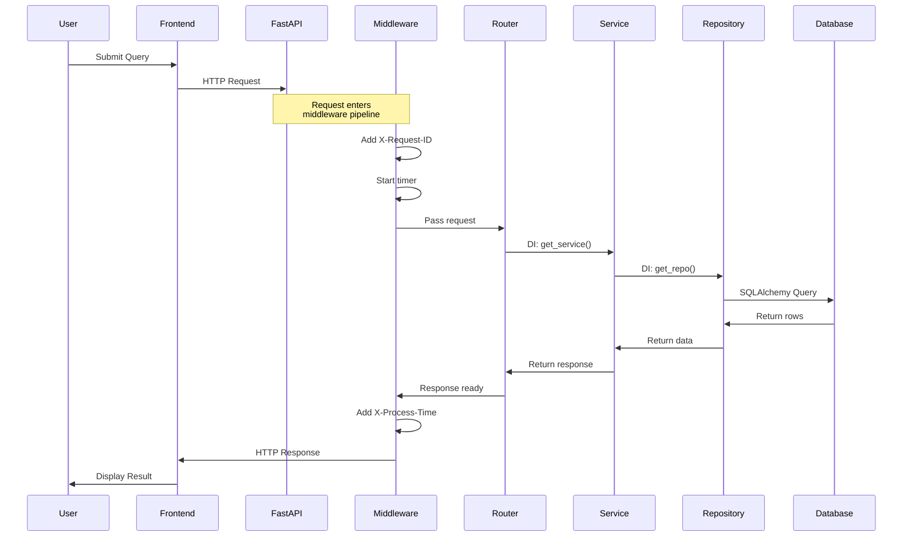
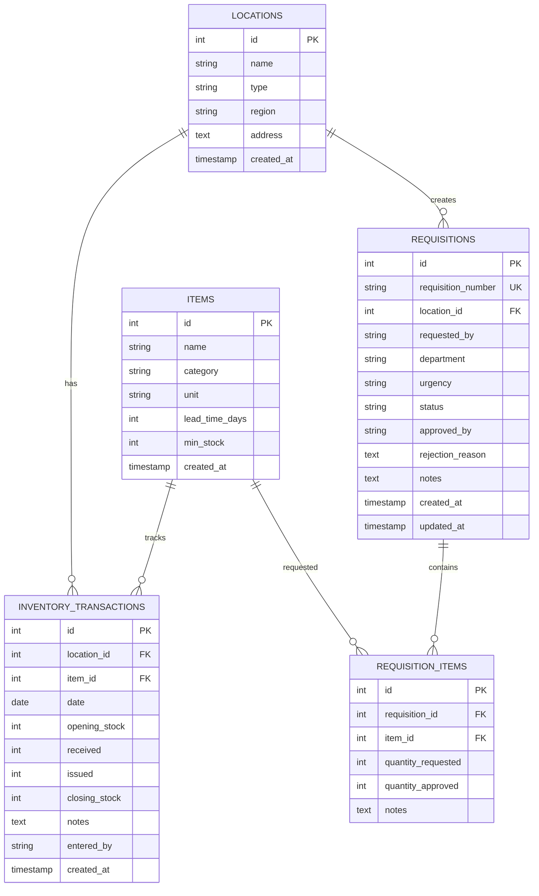
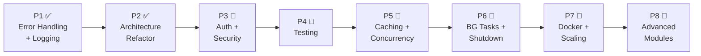

# Smart Inventory Assistant

An AI-powered inventory management system for healthcare supply chains. Built with FastAPI, React, LangChain, and ChromaDB for intelligent inventory insights, voice-enabled queries, and persistent conversational memory.

> **Architecture**: Modular Monolith — a single deployable unit with cleanly separated internal modules (repositories, services, routes) that communicate through dependency injection, not HTTP calls. Easy to develop and test now, easy to split into microservices later if needed.

> **Status**: 10/27 modules implemented (37%) | 14 modules remaining

---

## Overview

Smart Inventory Assistant helps hospital administrators manage medicine inventory across multiple locations by:
- **Real-time stock monitoring** across 8 healthcare locations
- **AI-powered chatbot** with conversational memory and voice input
- **Speech-to-Text** via Sarvam AI for hands-free queries
- **Long-term semantic memory** using ChromaDB for cross-session recall
- **Automated alerts** for critical and warning stock levels
- **Predictive analytics** with reorder recommendations
- **Visual heatmaps** for quick status overview
- **Role-based UI panels**: Vendor panel for data entry, Admin panel for dashboard + chatbot

---

## Tech Stack

| Layer | Technology |
|-------|------------|
| **Backend** | FastAPI 0.104.1, SQLAlchemy 2.0.23, Pydantic 2.8+ |
| **Frontend** | React 18 + Vite, Tailwind CSS |
| **Database** | SQLite (chat sessions + inventory), ChromaDB (vector memory) |
| **AI/ML** | LangChain, LangGraph, Groq API (LLaMA) |
| **Speech-to-Text** | Sarvam AI (saaras:v3 model) |
| **Memory** | SQLite (short-term context) + ChromaDB (long-term semantic search) |
| **Observability** | LangSmith (LLM tracing), Structured logging, Request correlation IDs |
| **Deployment** | Docker (placeholder), Uvicorn |
| **Configuration** | python-dotenv, centralized Settings class |

---

## Project Structure

```
smart-invantory-assistant/
├── backend/
│   └── app/
│       ├── main.py                     # FastAPI entry point + middleware registration
│       ├── config.py                   # Centralized Settings (env-based)
│       ├── api/
│       │   └── routes/
│       │       ├── analytics.py        # Analytics endpoints
│       │       ├── chat.py             # Chatbot + STT endpoints
│       │       ├── inventory.py        # Inventory CRUD (DI-injected)
│       │       └── requisition.py      # Stock-OUT requisition workflow
│       ├── core/                       # Cross-cutting concerns
│       │   ├── exceptions.py           # Custom exception hierarchy (8 classes)
│       │   ├── error_handlers.py       # Global FastAPI exception handlers
│       │   ├── logging_config.py       # Structured logging setup
│       │   └── dependencies.py         # FastAPI DI factories (repos → services)
│       ├── middleware/                 # Request pipeline
│       │   └── request_logger.py      # Request timing + X-Request-ID correlation
│       ├── repositories/               # Data access layer
│       │   ├── inventory_repo.py       # All inventory DB queries (20 methods)
│       │   └── requisition_repo.py     # All requisition DB queries (15 methods)
│       ├── schemas/                    # Response models
│       │   └── __init__.py             # APIResponse, PaginatedResponse, ErrorResponse
│       ├── database/
│       │   ├── connection.py           # SQLite engine/session factory
│       │   ├── models.py              # ORM models (7 tables)
│       │   └── queries.py             # Stock health queries
│       ├── services/
│       │   ├── analytics_service.py    # Analytics business logic
│       │   ├── inventory_service.py    # Transaction management (DI-injected)
│       │   ├── requisition_service.py  # Requisition workflow (DI-injected)
│       │   ├── ai_agent/
│       │   │   ├── agent.py            # LangGraph agent + memory
│       │   │   ├── tools.py            # Database query tools
│       │   │   └── prompts.py          # Dynamic system prompts
│       │   └── memory/
│       │       └── vector_store.py     # ChromaDB long-term semantic memory
│       └── utils/
│           └── calculations.py         # Utility functions
├── frontend/
│   └── smart-inventory-web/            # React + Vite frontend
│       └── src/
│           ├── pages/
│           │   ├── admin/
│           │   │   ├── Chatbot.jsx     # Chat UI with mic button
│           │   │   ├── Dashboard.jsx   # Analytics dashboard
│           │   │   ├── Requisitions.jsx# Manager approval panel
│           │   │   └── Inventory.jsx  # Inventory management
│           │   ├── staff/
│           │   │   └── StaffRequisition.jsx  # Staff request form
│           │   └── vendor/
│           │       └── DataEntry.jsx   # Vendor stock-in form
│           ├── components/
│           │   └── layout/
│           │       ├── AdminLayout.jsx # Admin layout wrapper
│           │       └── Sidebar.jsx     # Navigation menu
│           └── services/
│               └── api.js             # Axios API client
├── database/
│   ├── schema.sql                      # Full schema (7 tables + indexes)
│   ├── seed_data.py                    # Sample data generator
│   └── smart_inventory.db              # Local SQLite DB (gitignored)
├── data/chromadb/                      # ChromaDB storage (auto-created)
├── requirements.txt
├── .env.example
├── Dockerfile                          # Placeholder
├── docker-compose.yml                  # Placeholder
└── implementation_plan.md              # 27-module implementation roadmap
```

---

## System Architecture Diagram

```mermaid
flowchart TB
    subgraph "Frontend Layer"
        direction TB
        REACT[React 18 + Vite]
        ROUTER[React Router]
        AXIOS[Axios Client]
        TAILWIND[Tailwind CSS]
    end

    subgraph "FastAPI Backend"
        direction TB
        MAIN[main.py - Entry Point]
        
        subgraph "API Routes"
            ROUTES1[/api/analytics]
            ROUTES2[/api/inventory]
            ROUTES3[/api/chat]
            ROUTES4[/api/requisition]
        end
        
        subgraph "Core Infrastructure"
            EXCEPT[exceptions.py<br/>8 Custom Exceptions]
            HANDLERS[error_handlers.py<br/>Global Handlers]
            LOGGING[logging_config.py<br/>Structured Logging]
            DEPS[dependencies.py<br/>DI Factories]
        end
        
        subgraph "Middleware"
            REQLOG[request_logger.py<br/>X-Request-ID + Timing]
        end
        
        subgraph "Services Layer"
            ANALYTICS[analytics_service.py]
            INVENTORY[inventory_service.py]
            REQUISITION[requisition_service.py]
            
            subgraph "AI Agent"
                AGENT[agent.py<br/>LangGraph]
                TOOLS[tools.py<br/>DB Tools]
                PROMPTS[prompts.py<br/>System Prompts]
            end
            
            subgraph "Memory"
                VECTOR[vector_store.py<br/>ChromaDB]
            end
        end
        
        subgraph "Repositories"
            INV_REPO[inventory_repo.py<br/>20 Methods]
            REQ_REPO[requisition_repo.py<br/>15 Methods]
        end
        
        subgraph "Database"
            SQLALCHEMY[SQLAlchemy 2.0]
            MODELS[models.py<br/>7 ORM Models]
        end
    end

    subgraph "External Services"
        GROQ[Groq API<br/>LLaMA LLM]
        SARVAM[Sarvam AI<br/>Speech-to-Text]
        LANGSMITH[LangSmith<br/>LLM Tracing]
    end

    subgraph "Data Storage"
        SQLITE[(SQLite<br/>Inventory + Sessions)]
        CHROMADB[(ChromaDB<br/>Vector Memory)]
    end

    REACT --> AXIOS
    AXIOS --> MAIN
    MAIN --> ROUTES1
    MAIN --> ROUTES2
    MAIN --> ROUTES3
    MAIN --> ROUTES4
    
    ROUTES1 --> ANALYTICS
    ROUTES2 --> INVENTORY
    ROUTES3 --> AGENT
    ROUTES4 --> REQUISITION
    
    ANALYTICS --> INV_REPO
    INVENTORY --> INV_REPO
    REQUISITION --> REQ_REPO
    
    AGENT --> TOOLS
    AGENT --> PROMPTS
    AGENT --> VECTOR
    TOOLS --> INV_REPO
    
    INV_REPO --> SQLALCHEMY
    REQ_REPO --> SQLALCHEMY
    
    ANALYTICS --> LOGGING
    INVENTORY --> LOGGING
    REQUISITION --> LOGGING
    
    ROUTES1 --> EXCEPT
    ROUTES2 --> EXCEPT
    ROUTES3 --> EXCEPT
    ROUTES4 --> EXCEPT
    
    EXCEPT --> HANDLERS
    
    MAIN --> REQLOG
    
    SQLALCHEMY --> MODELS
    MODELS --> SQLITE
    
    AGENT --> GROQ
    AGENT --> SARVAM
    AGENT --> LANGSMITH
```

---

## Data Flow Architecture

```mermaid
flowchart TB
    subgraph "User Request"
        USER[(User)]
        VOICE[🎤 Voice Input]
        TEXT[📝 Text Input]
    end

    subgraph "Frontend"
        CHAT[Chatbot.jsx]
        API[api.js - Axios]
    end

    subgraph "Backend - Chat Flow"
        ROUTE[/api/chat/query]
        AGENT[AI Agent Service]
        
        subgraph "Memory Retrieval"
            SQLITE[(SQLite<br/>Session History)]
            CHROMADB[(ChromaDB<br/>Semantic Memory)]
        end
        
        subgraph "LangGraph Workflow"
            PROMPT[System Prompt<br/>+ Date Context]
            LLM[Groq LLM]
            TOOLS[Database Tools]
        end
    end

    subgraph "Response Flow"
        SAVE_SQL[Save to SQLite]
        SAVE_CHROMA[Save to ChromaDB]
        JSON[(JSON Response)]
    end

    USER --> VOICE
    USER --> TEXT
    
    VOICE --> |"1. Record Audio"| CHAT
    TEXT --> CHAT
    
    CHAT --> |"2. HTTP POST"| API
    API --> ROUTE
    
    ROUTE --> AGENT
    
    AGENT --> |"3. Load Session"| SQLITE
    AGENT --> |"4. Semantic Search"| CHROMADB
    
    AGENT --> PROMPT
    PROMPT --> LLM
    LLM --> TOOLS
    
    TOOLS --> |"5. Query DB"| SQLITE
    
    LLM --> |"6. Generate Response"| SAVE_SQL
    LLM --> |"7. Store Memory"| SAVE_CHROMA
    
    SAVE_SQL --> JSON
    SAVE_CHROMA --> JSON
    
    JSON --> API
    API --> CHAT
    CHAT --> USER
```

---

## Request-Response Flow Diagram


```mermaid
sequenceDiagram
    participant User
    participant Frontend
    participant FastAPI
    participant Middleware
    participant Router
    participant Service
    participant Repository
    participant Database
    
    User->>Frontend: Submit Query
    Frontend->>FastAPI: HTTP Request
    
    Note over FastAPI,Middleware: Request enters<br/>middleware pipeline
    
    Middleware->>Middleware: Add X-Request-ID
    Middleware->>Middleware: Start timer
    Middleware->>Router: Pass request
    
    Router->>Service: DI: get_service()
    Service->>Repository: DI: get_repo()
    Repository->>Database: SQLAlchemy Query
    
    Database->>Repository: Return rows
    Repository->>Service: Return data
    Service->>Router: Return response
    
    Router->>Middleware: Response ready
    Middleware->>Middleware: Add X-Process-Time
    Middleware->>Frontend: HTTP Response
    
    Frontend->>User: Display Result
```

---

## Database Schema

### Core Tables

| Table | Description | Records |
|-------|-------------|---------|
| `locations` | Healthcare facilities | 8 |
| `items` | Medical supplies | 30 |
| `inventory_transactions` | Daily stock movements | 14,400 |
| `stock_health` | Real-time stock analysis (VIEW) | — |

### Requisition Tables

| Table | Description |
|-------|-------------|
| `requisitions` | Stock-out requests |
| `requisition_items` | Items in each request |

### Schema Diagram


```mermaid
erDiagram
    LOCATIONS ||--o{ INVENTORY_TRANSACTIONS : has
    ITEMS ||--o{ INVENTORY_TRANSACTIONS : tracks
    LOCATIONS ||--o{ REQUISITIONS : creates
    ITEMS ||--o{ REQUISITION_ITEMS : requested
    REQUISITIONS ||--o{ REQUISITION_ITEMS : contains

    LOCATIONS {
        int id PK
        string name
        string type
        string region
        text address
        timestamp created_at
    }

    ITEMS {
        int id PK
        string name
        string category
        string unit
        int lead_time_days
        int min_stock
        timestamp created_at
    }

    INVENTORY_TRANSACTIONS {
        int id PK
        int location_id FK
        int item_id FK
        date date
        int opening_stock
        int received
        int issued
        int closing_stock
        text notes
        string entered_by
        timestamp created_at
    }

    REQUISITIONS {
        int id PK
        string requisition_number UK
        int location_id FK
        string requested_by
        string department
        string urgency
        string status
        string approved_by
        text rejection_reason
        text notes
        timestamp created_at
        timestamp updated_at
    }

    REQUISITION_ITEMS {
        int id PK
        int requisition_id FK
        int item_id FK
        int quantity_requested
        int quantity_approved
        text notes
    }
```

---

## Features Implemented

### 1. Database & Data Model ✅

- **3 Core Tables**: Locations (8), Items (30), Inventory Transactions (14,400)
- **1 Database View**: `stock_health` for real-time stock analysis
- **Location Types**: Hospitals, Clinics, Rural Clinics across India
- **Item Categories**: Antibiotics, Painkillers, Vitamins, Diabetes, First Aid
- **Sample Data**: 60 days of realistic consumption patterns with varying demand profiles

### 2. REST API Endpoints ✅

#### Analytics (`/api/analytics`)
- `GET /heatmap` - Stock health matrix for all locations/items
- `GET /alerts?severity=CRITICAL|WARNING` - Filterable stock alerts with reorder suggestions
- `GET /summary` - Overall statistics with category breakdown

#### Inventory Management (`/api/inventory`)
- `GET /locations` - List all 8 locations
- `GET /items` - List all 30 medical items
- `POST /locations` - Create location from user input
- `POST /items` - Create item from user input
- `GET /location/{id}/items` - Items with current stock for location
- `GET /stock/{location_id}/{item_id}` - Current stock level
- `POST /transaction` - Add single inventory transaction
- `POST /bulk-transaction` - Batch entry for daily updates
- `POST /reset-data` - Clear existing data before fresh manual entry

#### AI Chatbot (`/api/chat`)
- `POST /query` - Natural language inventory queries (with conversation memory)
- `POST /transcribe` - Speech-to-text via Sarvam AI
- `GET /sessions` - List all chat sessions
- `GET /suggestions` - Predefined question suggestions
- `GET /history/{conversation_id}` - Conversation history (persisted in SQLite)
- `DELETE /history/{conversation_id}` - Clear history

### 3. AI Agent Capabilities ✅

The chatbot (powered by LangGraph + Groq) can:
- Answer questions about critical stock levels
- Provide location-specific inventory status
- Calculate reorder recommendations with reasoning
- Analyze consumption trends
- **Remember conversation context** within a session (short-term memory)
- **Recall relevant facts from past sessions** via semantic search (long-term memory)
- **Understand relative time** references (e.g., "last month", "yesterday")
- Accept **voice input** via Speech-to-Text (Sarvam AI)
- Format responses in natural language with actionable insights

**Example queries**:
- "What items are critical right now?"
- "Show me stock status in Mumbai"
- "What should I order for Delhi?"
- "How's our paracetamol inventory?"

### 4. Stock Health Algorithm ✅

- **7-day rolling average** consumption calculation
- **Days remaining** = Current Stock / Avg Daily Usage
- **Status thresholds**:
  - CRITICAL: < 3 days remaining
  - WARNING: 3-7 days remaining
  - HEALTHY: > 7 days remaining
- **Reorder formula**: (Daily Usage × Lead Time × Safety Factor) - Current Stock

### 5. Speech-to-Text (Sarvam AI) ✅

- **Voice Input**: Mic button in chat UI records audio via MediaRecorder API
- **Transcription**: Audio sent to Sarvam AI's `speech-to-text-translate` endpoint (saaras:v3 model)
- **Auto-translation**: Supports Hindi/regional language input, translates to English
- **Seamless UX**: Transcribed text fills the input field for review before sending

### 6. Conversational Memory ✅

#### Short-Term Memory (SQLite)
- `ChatSession` and `ChatMessage` tables persist every conversation
- Agent loads last 10 messages with timestamps before answering
- Enables follow-up questions like "What else?" or "Tell me more"

#### Long-Term Memory (ChromaDB)
- Every Q&A pair is embedded and stored in a persistent ChromaDB collection
- Before answering, agent searches ChromaDB for semantically relevant past conversations
- Current session is excluded (already loaded via SQLite) to avoid duplication
- **Graceful degradation**: If ChromaDB is unavailable, bot still works with SQLite-only
- **No API key needed**: Uses ChromaDB's built-in local embeddings

#### Temporal Awareness
- System prompt includes **current date/time** dynamically
- Each message carries a timestamp (e.g., `[2026-02-20 00:05]`)
- Agent resolves relative time ("last month", "yesterday") using date context

### 7. Stock OUT Requisition Workflow ✅

- **Department Staff Portal** (`StaffRequisition.jsx`): Create requisition requests with urgency levels
- **Manager Approval Panel** (`Requisitions.jsx`): Review, approve, or reject requests
- **Automatic Stock Deduction**: On approval, inventory transactions are created automatically
- **Status Tracking**: PENDING → APPROVED/REJECTED/CANCELLED with full audit trail
- **Dashboard Stats**: Total, pending, approved today, rejected, emergency counts

### 8. Backend Engineering (Modular Monolith) ✅

> **Why Modular Monolith?** This project is a single-team, single-deployment healthcare tool. Microservices would add network complexity, distributed transactions, and deployment overhead with zero benefit at this scale. A modular monolith gives us clean separation (easy to test, easy to extend) while keeping deployment simple. If we ever need to scale a specific module (e.g., the AI agent), we can extract it into a service later — the repository/DI boundaries already make that straightforward.

#### Architecture Layers

```
[Routes] → [Depends()] → [Services] → [Repositories] → [SQLAlchemy] → [DB]
   ↑              ↑             ↑              ↑
 Pydantic     FastAPI DI    Business      Data access
 validation   factories      logic         queries
```

#### Completed Modules

| Module | What It Does | Why It Matters |
|--------|-------------|----------------|
| **Error Handling** | Custom exception hierarchy (`NotFoundError`, `ValidationError`, etc.) + global handlers | Every error returns consistent JSON `{success, error: {code, message}}`. No stack traces leak to clients. |
| **Logging** | Structured logging via Python `logging` module. Every request logged with timing + correlation ID | Replaces scattered `print()`. When something breaks in production, you can trace the exact request path via `X-Request-ID`. |
| **Repository Pattern** | `InventoryRepository` (20 methods), `RequisitionRepository` (15 methods) | Services don't write SQL. If you switch from SQLite to PostgreSQL, only repos change. Makes unit testing trivial (mock the repo). |
| **Dependency Injection** | FastAPI `Depends()` factories wire repos → services automatically | Routes don't create objects manually. Each request gets its own DB session → repo → service chain. Enables testing with fake dependencies. |
| **Response Schemas** | `APIResponse`, `PaginatedResponse`, `ErrorResponse` Pydantic models | Every endpoint returns the same shape. Frontend can rely on `response.success` and `response.data` universally. |
| **Request Middleware** | Logs `method path → status (duration) [request-id]`, adds `X-Request-ID` + `X-Process-Time` headers | You can correlate frontend errors to exact backend requests. Performance monitoring built-in. |

### 9. Security & Configuration ✅ (Partial)

- Environment-based configuration (`.env` + centralized `Settings` class)
- CORS middleware for frontend integration
- Input validation with Pydantic models (Field constraints, regex patterns)
- SQL injection protection via SQLAlchemy ORM
- LangSmith integration for LLM call tracing
- **Current limitation**: Role separation is UI-level only. Backend JWT auth is planned for Phase 3.

### 10. Frontend (React + Vite) ✅

- **Vendor Panel**: Data Entry page to add locations, items, and transactions
- **Admin Panel**: Dashboard + Chatbot + Requisition approval
- **Staff Portal**: Requisition request form with history
- **Chat UI**: Real-time chat with microphone button for voice input
- Built with React 18, Vite, and Tailwind CSS

---

## Full Module Audit (27 Modules)

### ✅ Core Backend Fundamentals (Modules 1–8)

| # | Module | Status | Evidence in Project |
|---|--------|--------|-------------------|
| 1 | **HTTP & Web** | ✅ Done | FastAPI handles HTTP natively. CORS configured in `main.py`. Health check endpoint exists. |
| 2 | **Routing & Path Ops** | ✅ Done | 4 route groups (`analytics`, `chat`, `inventory`, `requisition`), 20+ endpoints, prefix routing via `APIRouter`. |
| 3 | **JSON & Serialization** | ✅ Done | All endpoints return JSON. Pydantic `BaseModel` on all request/response bodies. `date` serialization handled. |
| 4 | **Auth & Authorization** | 🔴 Not Started | No JWT, no User model, no `get_current_user`. Role separation is UI-only. **Critical gap for resume.** |
| 5 | **Data Validation** | ✅ Done | Pydantic everywhere: `Field(ge=0)`, `min_length`, `max_length`, `pattern` regex on urgency. RequestValidationError handler. |
| 6 | **Architecture** | ✅ Done | Repository pattern (`inventory_repo.py`, `requisition_repo.py`), DI via `dependencies.py`, layered: routes → services → repos. |
| 7 | **API Design** | 🟡 Partial | Consistent `{success, data}` shape, health check, `/docs` auto-generated. **Missing:** `response_model` on routes, API versioning, pagination on list endpoints. |
| 8 | **Databases & ORM** | ✅ Done | SQLAlchemy 2.0, 7 ORM models, `create_all()` auto-migration, `get_db` session factory, joinedload for N+1 prevention. |

### 🟡 Intermediate Backend (Modules 9–14)

| # | Module | Status | Evidence in Project |
|---|--------|--------|-------------------|
| 9 | **Caching** | 🔴 Not Started | No `cachetools`, no Redis, no LRU. Every request hits DB fresh. |
| 10 | **Task Queues** | 🔴 Not Started | No `BackgroundTasks`, no Celery. ChromaDB writes are synchronous (blocks response). |
| 11 | **Error Handling** | ✅ Done | 8 custom exceptions in `core/exceptions.py`. 3 global handlers in `error_handlers.py`. Zero `HTTPException` remaining. |
| 12 | **Config Management** | ✅ Done | Centralized `Settings` class in `config.py`, `.env` file, `python-dotenv`, env-based log levels. |
| 13 | **Logging & Observability** | ✅ Done | Structured logging (`logging_config.py`), request middleware with `X-Request-ID` + `X-Process-Time`, LangSmith integration for LLM tracing. |
| 14 | **Graceful Shutdown** | 🔴 Not Started | No `lifespan` context manager. No `engine.dispose()`. DB connections leak on Ctrl+C. |

### 🔴 Security & Performance (Modules 15–17)

| # | Module | Status | Evidence in Project |
|---|--------|--------|-------------------|
| 15 | **Backend Security** | 🔴 Not Started | No rate limiting, no security headers (`X-Content-Type-Options`, `X-Frame-Options`), CORS allows `*` methods. |
| 16 | **Scaling A** | 🟡 Partial | Request timing middleware exists (`X-Process-Time`). **Missing:** slow query logging, N+1 detection, DB connection pooling config. |
| 17 | **Scaling B** | 🔴 Not Started | Dockerfile is a placeholder (`alpine + sleep`). No multi-worker Uvicorn. No Gunicorn. Single-process only. |

### 🔴 Concurrency & Advanced Systems (Module 18)

| # | Module | Status | Evidence in Project |
|---|--------|--------|-------------------|
| 18 | **Concurrency** | 🔴 Not Started | All routes are `def` (sync). No `async def`. No connection pooling config. Default SQLite thread mode. |

### 🔴 Testing & Quality (Module 19)

| # | Module | Status | Evidence in Project |
|---|--------|--------|-------------------|
| 19 | **Testing** | 🔴 Not Started | Zero test files. No `pytest`, no `TestClient`, no `conftest.py`. No DI overrides for testing. **Big resume gap.** |

### 🔴 Cloud & Real-Time (Modules 20–22)

| # | Module | Status | Evidence in Project |
|---|--------|--------|-------------------|
| 20 | **Object Storage (S3)** | 🔴 Not Started | No file uploads to cloud. Audio files processed in-memory only. |
| 21 | **Real-Time (WebSockets)** | 🔴 Not Started | Chat is request-response only. No WebSocket endpoint. No real-time stock alerts. |
| 22 | **Webhooks** | 🔴 Not Started | No server-to-server callbacks. No HMAC verification. No idempotency keys. |

### 🔴 Search, Email & Documentation (Modules 23–25)

| # | Module | Status | Evidence in Project |
|---|--------|--------|-------------------|
| 23 | **Advanced Search** | 🔴 Not Started | No Elasticsearch. Search is basic SQL `LIKE`. ChromaDB is for AI memory, not user-facing search. |
| 24 | **Transactional Emails** | 🔴 Not Started | No email service. No SendGrid/SES. No notification on requisition status change. |
| 25 | **API Documentation** | 🟡 Partial | Swagger UI works at `/docs`, auto-generated from routes. **Missing:** `response_model` on endpoints, explicit examples, ReDoc customization. |

### 🔴 Cloud-Native & DevOps (Modules 26–27)

| # | Module | Status | Evidence in Project |
|---|--------|--------|-------------------|
| 26 | **12-Factor App** | 🟡 Partial | Config from env ✅, stateless ✅. **Missing:** proper log streams, dev/prod parity, disposability. |
| 27 | **DevOps & Docker** | 🔴 Not Started | Dockerfile is placeholder. No multi-stage build. No `docker-compose.yml` services. No CI/CD. |

---

## Score Summary

```
✅ Done:        10/27 modules (37%)
🟡 Partial:      3/27 modules (11%)
🔴 Not Started: 14/27 modules (52%)
```

---

## Implementation Roadmap

> Phases are ordered by **dependency chain**: each phase builds on the previous one.


```mermaid
flowchart LR
    P1["P1 ✅<br/>Error Handling<br/>+ Logging"] --> P2["P2 ✅<br/>Architecture<br/>Refactor"]
    P2 --> P3["P3 🔴<br/>Auth +<br/>Security"]
    P3 --> P4["P4 🔴<br/>Testing"]
    P4 --> P5["P5 🔴<br/>Caching +<br/>Concurrency"]
    P5 --> P6["P6 🔴<br/>BG Tasks +<br/>Shutdown"]
    P6 --> P7["P7 🔴<br/>Docker +<br/>Scaling"]
    P7 --> P8["P8 🔴<br/>Advanced<br/>Modules"]
```

| Phase | Modules | Status | Time | What You Get |
|-------|---------|--------|------|-------------|
| **P1** | 11 + 13 | ✅ Done | — | Custom exceptions, structured logging, request correlation |
| **P2** | 6 + 7 | ✅ Done | — | Repository pattern, DI, response schemas |
| **P3** | 4 + 15 | 🔴 Next | ~3-4 hrs | JWT auth, User model, role-based access, rate limiting, security headers |
| **P4** | 19 | 🔴 Planned | ~2-3 hrs | Pytest suite, TestClient, fixture factories, DI overrides, ≥80% coverage |
| **P5** | 9 + 18 | 🔴 Planned | ~2-3 hrs | In-memory TTL cache, cache invalidation, connection pooling |
| **P6** | 10 + 14 | 🔴 Planned | ~2 hrs | BackgroundTasks, lifespan shutdown, resource cleanup |
| **P7** | 17 + 27 | 🔴 Planned | ~2-3 hrs | Production Dockerfile, docker-compose, multi-worker, Gunicorn |
| **P8** | 20-26 | 🔴 Optional | ~4-6 hrs | WebSockets, webhooks, emails, S3, 12-factor, advanced search |

---

## 🎯 Resume Priority Guide — Backend Engineer Job Market

### 🔴 MUST-HAVE for Resume (Non-Negotiable)

These will be asked in **every** backend interview. Missing any = immediate red flag:

| Module | Why Interviewers Care | Your Status |
|--------|----------------------|-------------|
| **Auth (Module 4)** | "How does your app handle authentication?" is Q1 in every interview. JWT, password hashing, role-based middleware. | 🔴 P3 |
| **Testing (Module 19)** | "Show me your tests" — no tests = junior signal. Pytest + TestClient + ≥80% coverage. | 🔴 P4 |
| **Docker (Module 27)** | "Can you containerize this?" — expected baseline. Multi-stage Dockerfile + docker-compose. | 🔴 P7 |
| **Error Handling (Module 11)** | Custom exceptions, global handlers, no stack trace leaks. | ✅ Done |
| **Architecture (Module 6)** | Repository pattern, DI, layered architecture proves you think beyond CRUD. | ✅ Done |

### 🟡 STRONG DIFFERENTIATORS (Top 20% of candidates)

Adding even 2-3 of these makes your project stand out:

| Module | Why It Stands Out | Your Status |
|--------|------------------|-------------|
| **Caching (Module 9)** | Shows you understand performance at scale | 🔴 P5 |
| **Background Tasks (Module 10)** | Async processing is expected in production systems | 🔴 P6 |
| **WebSockets (Module 21)** | Real-time = modern. Live stock alerts via WebSocket is impressive. | 🔴 P8 |
| **Graceful Shutdown (Module 14)** | Shows production maturity. Most juniors skip this. | 🔴 P6 |
| **Rate Limiting (Module 15)** | Security awareness. Easy to implement, impressive to mention. | 🔴 P3 |

### 🟢 NICE-TO-HAVE (If Time Permits)

These are bonus points but won't make or break an application:

| Module | Notes |
|--------|-------|
| S3 / Object Storage (20) | Only if your project handles file uploads |
| Webhooks (22) | Impressive but niche |
| Elasticsearch (23) | Only for search-heavy apps |
| Transactional Emails (24) | Good but not core backend |
| 12-Factor App (26) | More of a philosophy checklist than code |

### 📊 Bottom Line

> **To be job-ready as a backend engineer, implement through Phase 7** (P1–P7).
> That gives you **19/27 modules** covering Auth, Testing, Docker, Caching, Background Tasks, and Scaling.
>
> **Minimum viable resume project**: Complete P1 → P2 → P3 → P4 → P7.
> That's 5 phases ≈ 12-15 hours of work and covers all the non-negotiable items.
>
> Your current progress: **P1 + P2 done** (10/27). You need ~3-4 more phases.

---

## Quickstart

### Prerequisites

- Python 3.11+
- Node.js 18+ (for frontend)
- (Optional) Groq API key for AI features
- (Optional) Sarvam AI API key for voice input

### Installation

```bash
# Clone and navigate
cd smart-invantory-assistant

# Create virtual environment
python -m venv venv

# Activate (Windows)
venv\Scripts\activate
# Activate (Linux/Mac)
# source venv/bin/activate

# Install dependencies
pip install -r requirements.txt

# Setup environment
cp .env.example .env
# Edit .env and add your GROQ_API_KEY and SARVAM_API_KEY (optional)

# Generate sample data
cd database
python seed_data.py

# Start backend server
cd ../backend
uvicorn app.main:app --reload

# Start frontend (in a new terminal)
cd frontend/smart-inventory-web
npm install
npm run dev
```

### Access

- **Frontend**: http://localhost:5173
- **API Docs**: http://localhost:8000/docs
- **Health Check**: http://localhost:8000/health
- **Root**: http://localhost:8000/

---

## API Usage Examples

### Get Stock Alerts

```bash
curl "http://localhost:8000/api/analytics/alerts?severity=CRITICAL"
```

### Add Transaction

```bash
curl -X POST "http://localhost:8000/api/inventory/transaction" \
  -H "Content-Type: application/json" \
  -d '{
    "location_id": 1,
    "item_id": 1,
    "date": "2024-02-13",
    "received": 100,
    "issued": 50,
    "entered_by": "staff"
  }'
```

### Chat Query

```bash
curl -X POST "http://localhost:8000/api/chat/query" \
  -H "Content-Type: application/json" \
  -d '{
    "question": "What items are critical?",
    "user_id": "admin"
  }'
```

---

## Test the AI Agent

```bash
cd backend
python test_agent.py
```

---

## Configuration

| Variable | Default | Description |
|----------|---------|-------------|
| `DATABASE_PATH` | `../database/smart_inventory.db` | SQLite database location |
| `GROQ_API_KEY` | `None` | Groq API key for AI features |
| `SARVAM_API_KEY` | `None` | Sarvam AI key for Speech-to-Text |
| `LANGCHAIN_API_KEY` | `None` | LangSmith API key for LLM tracing |
| `LANGCHAIN_PROJECT` | `smart-inventory-assistant` | LangSmith project name |
| `ENVIRONMENT` | `development` | App environment (`development` / `production`) |
| `CORS_ORIGINS` | `http://localhost:3000,...` | Allowed frontend origins |
| `API_V1_PREFIX` | `/api` | API route prefix |

---

## Upcoming Implementation Details

### Phase 3: Auth + Security (Modules 4, 15)

#### Authentication (Module 4)

**New Files:**
- `backend/app/core/security.py` - JWT token utilities
  - Password hashing using passlib + bcrypt
  - `create_access_token(user_id, role)` → JWT
  - `verify_token(token)` → payload
  - SECRET_KEY from settings

**Model Addition:**
- Add `User` model to `backend/app/database/models.py`
  ```python
  class User(Base):
      __tablename__ = "users"
      id, username, email, hashed_password, role, department, is_active
      # role: "super_admin" | "store_manager" | "dept_staff" | "vendor"
  ```

**New Routes:**
- `backend/app/api/routes/auth.py`
  ```
  POST /api/auth/register    → create user
  POST /api/auth/login       → return JWT
  GET  /api/auth/me          → current user profile
  ```

**Middleware:**
- `backend/app/middleware/auth_middleware.py`
  ```python
  def get_current_user(token: str = Depends(oauth2_scheme)):
      # decode JWT → return User

  def require_role(*roles):
      # dependency that checks user.role in roles
  ```

#### Security Hardening (Module 15)

**Middleware:**
- `backend/app/middleware/rate_limiter.py`
  - In-memory rate limiter (no Redis needed yet)
  - 60 req/min per IP for general endpoints
  - 10/min for auth endpoints

**Main.py Modifications:**
- Tighten CORS: specific origins only, remove `"*"` from methods
- Add rate limiter middleware
- Add security headers (X-Content-Type-Options, X-Frame-Options)

---

### Phase 4: Testing (Module 19)

**New Files:**
- `backend/tests/conftest.py` - Pytest fixtures
  - `db_session` fixture for test database
  - `client` fixture for TestClient
  - `override_dependencies` for DI testing

- `backend/tests/test_routes/` - Route tests
  - `test_analytics.py`
  - `test_inventory.py`
  - `test_chat.py`
  - `test_requisition.py`

- `backend/tests/test_services/` - Service tests
  - `test_analytics_service.py`
  - `test_inventory_service.py`

**Test Coverage Target:** ≥80%

---

### Phase 5: Caching + Concurrency (Modules 9, 18)

#### Caching (Module 9)

**New Files:**
- `backend/app/core/cache.py`
  ```python
  from functools import lru_cache
  from cachetools import TTLCache

  # Cache analytics stats (TTL: 60s)
  # Cache location list (TTL: 300s)
  # Cache item list (TTL: 300s)
  # Invalidate on write operations
  ```

**Modifications:**
- Add cache decorators to `analytics_service.py`
- Add cache invalidation to `inventory_service.py`

#### Concurrency (Module 18)

**Database Modifications:**
- Update `backend/app/database/connection.py`
  ```python
  engine = create_engine(
      DATABASE_URL,
      pool_size=5,
      max_overflow=10,
      pool_timeout=30,
      pool_pre_ping=True,
  )
  ```

---

### Phase 6: Background Tasks + Graceful Shutdown (Modules 10, 14)

#### Background Tasks (Module 10)

**New Files:**
- `backend/app/core/background.py`
  ```python
  # Background jobs:
  # 1. Send notification when requisition created
  # 2. Generate daily stock report
  # 3. ChromaDB memory indexing (background)
  ```

**Modifications:**
- Update `requisition.py` to queue notifications
- Update `chat.py` to async ChromaDB writes

#### Graceful Shutdown (Module 14)

**Main.py Modifications:**
- Add lifespan context manager
  ```python
  from contextlib import asynccontextmanager

  @asynccontextmanager
  async def lifespan(app: FastAPI):
      # STARTUP
      logger.info("Starting Smart Inventory Assistant...")
      setup_logging(settings.ENVIRONMENT)
      Base.metadata.create_all(bind=engine)
      yield
      # SHUTDOWN
      logger.info("Shutting down...")
      engine.dispose()
      # close ChromaDB client
      # flush pending background tasks
  ```

---

### Phase 7: Docker + Scaling (Modules 17, 27)

#### Dockerfile Improvements

**New Dockerfile:**
```dockerfile
FROM python:3.11-slim AS base
# Install dependencies
# ...

# Multi-stage build for production
FROM base AS production
CMD ["uvicorn", "app.main:app", "--host", "0.0.0.0", "--port", "8000", "--workers", "4"]
```

#### Docker Compose

**New docker-compose.yml:**
```yaml
services:
  backend:
    build: ./backend
    ports: ["8000:8000"]
    environment: [...]
    deploy:
      replicas: 2
  frontend:
    build: ./frontend/smart-inventory-web
    ports: ["5173:80"]
```

#### Gunicorn Configuration

**New File:**
- `backend/gunicorn.conf.py`
  ```python
  workers = 4
  worker_class = "uvicorn.workers.UvicornWorker"
  bind = "0.0.0.0:8000"
  timeout = 120
  ```

---

### Phase 8: Advanced Modules (20-26)

| Module | Description | Implementation |
|--------|-------------|----------------|
| 20 | Object Storage (S3) | File upload handling for audio files |
| 21 | Real-Time (WebSockets) | Live stock alerts, chat updates |
| 22 | Webhooks | Server-to-server callbacks |
| 23 | Advanced Search | Elasticsearch integration |
| 24 | Transactional Emails | SendGrid/SES integration |
| 26 | 12-Factor App | Log streams, dev/prod parity |

---

## Notes

- Database file (`smart_inventory.db`) is gitignored
- ChromaDB data is stored in `data/chromadb/` (auto-created, gitignored)
- Docker files are placeholders for future deployment
- AI features require Groq API key; app works without it for basic CRUD (fallback mode)
- Speech-to-Text requires Sarvam AI API key; chat still works via text without it
- ChromaDB runs 100% locally with built-in embeddings — no API key needed
- If ChromaDB is unavailable, the bot gracefully degrades to SQLite-only memory
- Vendor/Admin separation is currently enforced at UI level only; backend API role authorization is pending.
- Location profiles: High/Medium/Low volume × Good/Medium/Poor efficiency

---

## License

MIT

---

## Contributing

This is a personal project. Feel free to fork and extend!

---

**Last Updated**: March 2026 | **Version**: 2.2.0 | **Architecture**: Modular Monolith | **Module Progress**: 10/27 (37%)
