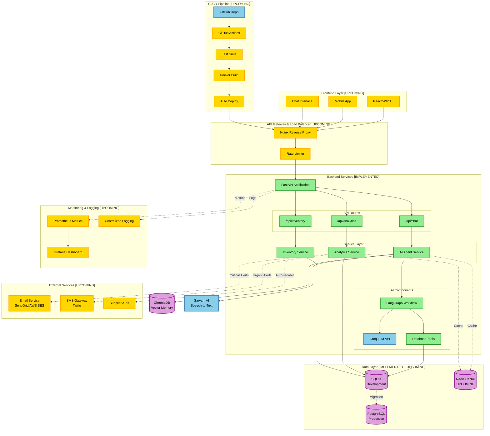

# Smart Inventory Assistant

An AI-powered inventory management system for healthcare supply chains. Built with FastAPI, React, LangChain, and ChromaDB for intelligent inventory insights, voice-enabled queries, and persistent conversational memory.

## Overview

Smart Inventory Assistant helps hospital administrators manage medicine inventory across multiple locations by:
- **Real-time stock monitoring** across 8 healthcare locations
- **AI-powered chatbot** with conversational memory and voice input
- **Speech-to-Text** via Sarvam AI for hands-free queries
- **Long-term semantic memory** using ChromaDB for cross-session recall
- **Automated alerts** for critical and warning stock levels
- **Predictive analytics** with reorder recommendations
- **Visual heatmaps** for quick status overview
- **Role-based UI panels**: Vendor panel for data entry, Admin panel for dashboard + chatbot

## Tech Stack

- **Backend**: FastAPI 0.104.1, SQLAlchemy 2.0.23, Pydantic 2.5.0
- **Frontend**: React 18 + Vite, Tailwind CSS
- **Database**: SQLite (chat sessions + inventory), ChromaDB (vector memory)
- **AI/ML**: LangChain, LangGraph, Groq API (GPT-oss-20b)
- **Speech-to-Text**: Sarvam AI (saaras:v3 model)
- **Memory**: SQLite (short-term context) + ChromaDB (long-term semantic search)
- **Deployment**: Docker (placeholder), Uvicorn
- **Configuration**: python-dotenv

## Project Structure

```
smart-invantory-assistant/
├── backend/
│   └── app/
│       ├── main.py                    # FastAPI entry point
│       ├── config.py                  # Environment configuration
│       ├── api/
│       │   └── routes/
│       │       ├── analytics.py       # Analytics endpoints
│       │       ├── chat.py            # Chatbot + STT endpoints
│       │       └── inventory.py       # CRUD endpoints
│       ├── database/
│       │   ├── connection.py          # SQLite engine/session
│       │   ├── models.py              # ORM models (incl. ChatSession, ChatMessage)
│       │   └── queries.py             # Stock health queries
│       ├── services/
│       │   ├── analytics_service.py   # Analytics business logic
│       │   ├── inventory_service.py   # Transaction management
│       │   ├── ai_agent/
│       │   │   ├── agent.py           # LangGraph agent + memory integration
│       │   │   ├── tools.py           # Database query tools
│       │   │   └── prompts.py         # Dynamic system prompts (date-aware)
│       │   └── memory/
│       │       ├── __init__.py
│       │       └── vector_store.py    # ChromaDB long-term semantic memory
│       └── utils/
│           └── calculations.py        # Utility functions
├── frontend/
│   └── smart-inventory-web/           # React + Vite frontend
│       └── src/
│           ├── pages/admin/
│           │   ├── Chatbot.jsx        # Chat UI with mic button
│           │   └── Dashboard.jsx      # Analytics dashboard
│           └── services/api.js        # Axios API client
├── database/
│   ├── schema.sql                     # Database schema
│   ├── seed_data.py                   # 60 days sample data generator
│   └── smart_inventory.db             # Local SQLite DB
├── data/
│   └── chromadb/                      # ChromaDB persistent storage (auto-created)
├── requirements.txt
├── docker-compose.yml                 # Empty (placeholder)
├── Dockerfile                         # Placeholder
└── .env.example                       # Environment template
```

## Features Implemented

### 1. Database & Data Model
- **3 Core Tables**: Locations (8), Items (30), Inventory Transactions (14,400)
- **1 Database View**: `stock_health` for real-time stock analysis
- **Location Types**: Hospitals, Clinics, Rural Clinics across India
- **Item Categories**: Antibiotics, Painkillers, Vitamins, Diabetes, First Aid
- **Sample Data**: 60 days of realistic consumption patterns with varying demand profiles

### 2. REST API Endpoints

#### Analytics (`/api/analytics`)
- `GET /heatmap` - Stock health matrix for all locations/items
- `GET /alerts?severity=CRITICAL|WARNING` - Filterable stock alerts with reorder suggestions
- `GET /summary` - Overall statistics with category breakdown

#### Inventory Management (`/api/inventory`)
- `GET /locations` - List all 8 locations
- `GET /items` - List all 30 medical items
- `POST /locations` - Create location from user input
- `POST /items` - Create item from user input
- `GET /location/{id}/items` - Items with current stock for location
- `GET /stock/{location_id}/{item_id}` - Current stock level
- `POST /transaction` - Add single inventory transaction
- `POST /bulk-transaction` - Batch entry for daily updates
- `POST /reset-data` - Clear existing data before fresh manual entry

#### AI Chatbot (`/api/chat`)
- `POST /query` - Natural language inventory queries (with conversation memory)
- `POST /transcribe` - Speech-to-text via Sarvam AI
- `GET /sessions` - List all chat sessions
- `GET /suggestions` - Predefined question suggestions
- `GET /history/{conversation_id}` - Conversation history (persisted in SQLite)
- `DELETE /history/{conversation_id}` - Clear history

### 3. AI Agent Capabilities
The chatbot (powered by LangGraph + Groq) can:
- Answer questions about critical stock levels
- Provide location-specific inventory status
- Calculate reorder recommendations with reasoning
- Analyze consumption trends
- **Remember conversation context** within a session (short-term memory)
- **Recall relevant facts from past sessions** via semantic search (long-term memory)
- **Understand relative time** references (e.g., "last month", "yesterday")
- Accept **voice input** via Speech-to-Text (Sarvam AI)
- Format responses in natural language with actionable insights

**Example queries**:
- "What items are critical right now?"
- "Show me stock status in Mumbai"
- "What should I order for Delhi?"
- "How's our paracetamol inventory?"

### 4. Stock Health Algorithm
- **7-day rolling average** consumption calculation
- **Days remaining** = Current Stock / Avg Daily Usage
- **Status thresholds**:
  - CRITICAL: < 3 days remaining
  - WARNING: 3-7 days remaining
  - HEALTHY: > 7 days remaining
- **Reorder formula**: (Daily Usage × Lead Time × Safety Factor) - Current Stock

### 5. Speech-to-Text (Sarvam AI)
- **Voice Input**: Mic button in chat UI records audio via MediaRecorder API
- **Transcription**: Audio sent to Sarvam AI's `speech-to-text-translate` endpoint (saaras:v3 model)
- **Auto-translation**: Supports Hindi/regional language input, translates to English
- **Seamless UX**: Transcribed text fills the input field for review before sending

### 6. Conversational Memory

#### Short-Term Memory (SQLite)
- `ChatSession` and `ChatMessage` tables persist every conversation
- Agent loads last 10 messages with timestamps before answering
- Enables follow-up questions like "What else?" or "Tell me more"

#### Long-Term Memory (ChromaDB)
- Every Q&A pair is embedded and stored in a persistent ChromaDB collection
- Before answering, agent searches ChromaDB for semantically relevant past conversations
- Current session is excluded (already loaded via SQLite) to avoid duplication
- **Graceful degradation**: If ChromaDB is unavailable, bot still works with SQLite-only
- **No API key needed**: Uses ChromaDB's built-in local embeddings

#### Temporal Awareness
- System prompt includes **current date/time** dynamically
- Each message carries a timestamp (e.g., `[2026-02-20 00:05]`)
- Agent resolves relative time ("last month", "yesterday") using date context

### 7. Security & Configuration
- Environment-based configuration (.env)
- CORS middleware for frontend integration
- Input validation with Pydantic models
- SQL injection protection via SQLAlchemy ORM
- **Current limitation**: Role separation is UI-level only. Backend API endpoints are not yet protected by JWT/session/role authorization.
- **Recommended next step**: Implement backend authentication + role-based authorization for secure vendor/admin separation.

### 8. Frontend (React + Vite)
- **Vendor Panel**: Data Entry page to add locations, items, and transactions
- **Admin Panel**: Dashboard + Chatbot pages
- **Chat UI**: Real-time chat with microphone button for voice input
- Built with React 18, Vite, and Tailwind CSS

## Quickstart

### Prerequisites
- Python 3.11+
- Node.js 18+ (for frontend)
- (Optional) Groq API key for AI features
- (Optional) Sarvam AI API key for voice input

### Installation

```bash
# Clone and navigate
cd smart-invantory-assistant

# Create virtual environment
python -m venv venv

# Activate (Windows)
venv\Scripts\activate
# Activate (Linux/Mac)
# source venv/bin/activate

# Install dependencies
pip install -r requirements.txt

# Setup environment
cp .env.example .env
# Edit .env and add your GROQ_API_KEY and SARVAM_API_KEY (optional)

# Generate sample data
cd database
python seed_data.py

# Start backend server
cd ../backend
uvicorn app.main:app --reload

# Start frontend (in a new terminal)
cd frontend/smart-inventory-web
npm install
npm run dev
```

### Access
- **Frontend**: http://localhost:5173
- **API Docs**: http://localhost:8000/docs
- **Health Check**: http://localhost:8000/health
- **Root**: http://localhost:8000/

## API Usage Examples

### Get Stock Alerts
```bash
curl "http://localhost:8000/api/analytics/alerts?severity=CRITICAL"
```

### Add Transaction
```bash
curl -X POST "http://localhost:8000/api/inventory/transaction" \
  -H "Content-Type: application/json" \
  -d '{
    "location_id": 1,
    "item_id": 1,
    "date": "2024-02-13",
    "received": 100,
    "issued": 50,
    "entered_by": "staff"
  }'
```

### Chat Query
```bash
curl -X POST "http://localhost:8000/api/chat/query" \
  -H "Content-Type: application/json" \
  -d '{
    "question": "What items are critical?",
    "user_id": "admin"
  }'
```

## Test the AI Agent

```bash
cd backend
python test_agent.py
```

## Configuration

| Variable | Default | Description |
|----------|---------|-------------|
| `DATABASE_PATH` | `../database/smart_inventory.db` | SQLite database location |
| `GROQ_API_KEY` | `None` | Groq API key for AI features |
| `SARVAM_API_KEY` | `None` | Sarvam AI key for Speech-to-Text |
| `ENVIRONMENT` | `development` | App environment |
| `CORS_ORIGINS` | `http://localhost:3000,...` | Allowed frontend origins |
| `API_V1_PREFIX` | `/api` | API route prefix |

## Architecture & Workflow Diagram


```mermaid
flowchart TB
    subgraph "Frontend Layer [UPCOMING]"
        UI[React/Web UI]
        MOBILE[Mobile App]
        CHAT_UI[Chat Interface]
    end

    subgraph "API Gateway & Load Balancer [UPCOMING]"
        NGINX[Nginx Reverse Proxy]
        RATE_LIMIT[Rate Limiter]
    end

    subgraph "Backend Services [IMPLEMENTED]"
        FASTAPI[FastAPI Application]

        subgraph "API Routes"
            ANALYTICS["/api/analytics"]
            INVENTORY["/api/inventory"]
            CHAT["/api/chat"]
        end

        subgraph "Service Layer"
            ANALYTICS_SVC[Analytics Service]
            INV_SVC[Inventory Service]
            AI_AGENT[AI Agent Service]
        end

        subgraph "AI Components"
            LANGGRAPH[LangGraph Workflow]
            GROQ[Groq LLM API]
            TOOLS[Database Tools]
        end
    end

    subgraph "Data Layer [IMPLEMENTED + UPCOMING]"
        SQLITE[(SQLite<br/>Development)]
        POSTGRES[(PostgreSQL<br/>Production)]
        REDIS[(Redis Cache<br/>UPCOMING)]
    end

    subgraph "External Services [UPCOMING]"
        EMAIL[Email Service<br/>SendGrid/AWS SES]
        SMS[SMS Gateway<br/>Twilio]
        SUPPLIERS[Supplier APIs]
    end

    subgraph "CI/CD Pipeline [UPCOMING]"
        GITHUB[GitHub Repo]
        ACTIONS[GitHub Actions]
        DOCKER[Docker Build]
        TEST[Test Suite]
        DEPLOY[Auto Deploy]
    end

    subgraph "Monitoring & Logging [UPCOMING]"
        PROMETHEUS[Prometheus Metrics]
        GRAFANA[Grafana Dashboard]
        LOGS[Centralized Logging]
    end

    %% User Flow
    UI --> NGINX
    MOBILE --> NGINX
    CHAT_UI --> NGINX
    NGINX --> RATE_LIMIT
    RATE_LIMIT --> FASTAPI

    %% API Routing
    FASTAPI --> ANALYTICS
    FASTAPI --> INVENTORY
    FASTAPI --> CHAT

    %% Service Connections
    ANALYTICS --> ANALYTICS_SVC
    INVENTORY --> INV_SVC
    CHAT --> AI_AGENT

    %% AI Agent Flow
    AI_AGENT --> LANGGRAPH
    LANGGRAPH --> GROQ
    LANGGRAPH --> TOOLS
    TOOLS --> SQLITE
    AI_AGENT --> CHROMADB[(ChromaDB<br/>Vector Memory)]
    AI_AGENT --> SARVAM[Sarvam AI<br/>Speech-to-Text]

    %% Services to Database
    ANALYTICS_SVC --> SQLITE
    INV_SVC --> SQLITE

    %% Database Connections
    SQLITE -.->|Migration| POSTGRES

    %% Cache Layer
    AI_AGENT -.->|Cache| REDIS
    ANALYTICS_SVC -.->|Cache| REDIS

    %% Notifications
    ANALYTICS_SVC -.->|Critical Alerts| EMAIL
    ANALYTICS_SVC -.->|Urgent Alerts| SMS
    INV_SVC -.->|Auto-reorder| SUPPLIERS

    %% CI/CD Flow
    GITHUB --> ACTIONS
    ACTIONS --> TEST
    TEST --> DOCKER
    DOCKER --> DEPLOY
    DEPLOY --> NGINX

    %% Monitoring
    FASTAPI -.->|Metrics| PROMETHEUS
    PROMETHEUS --> GRAFANA
    FASTAPI -.->|Logs| LOGS

    %% Styling
    classDef implemented fill:#90EE90,stroke:#228B22,stroke-width:2px,color:black
    classDef upcoming fill:#FFD700,stroke:#FFA500,stroke-width:2px,color:black
    classDef external fill:#87CEEB,stroke:#4682B4,stroke-width:2px,color:black
    classDef database fill:#DDA0DD,stroke:#8B008B,stroke-width:2px,color:black

    class FASTAPI,ANALYTICS,INVENTORY,CHAT,ANALYTICS_SVC,INV_SVC,AI_AGENT,LANGGRAPH,TOOLS,SQLITE,CHROMADB implemented
    class UI,MOBILE,CHAT_UI,NGINX,RATE_LIMIT,POSTGRES,REDIS,EMAIL,SMS,SUPPLIERS,ACTIONS,DOCKER,TEST,DEPLOY,PROMETHEUS,GRAFANA,LOGS upcoming
    class GROQ,GITHUB,SARVAM external
    class SQLITE,POSTGRES,REDIS,CHROMADB database
```

### Data Flow Description

#### Current Implementation (Green)
1. **FastAPI Backend** - Core application with 3 API route groups
2. **React Frontend** - Dashboard, Chatbot with voice input, Data Entry
3. **Analytics Service** - Heatmap, alerts, and summary calculations
4. **Inventory Service** - Transaction management and stock tracking
5. **AI Agent** - LangGraph-based conversational interface with Groq LLM
6. **Speech-to-Text** - Sarvam AI integration for voice queries
7. **SQLite Database** - Inventory data + persistent chat sessions
8. **ChromaDB** - Vector database for semantic long-term memory

#### Upcoming Pipeline (Yellow)
1. **API Gateway** - Nginx reverse proxy with rate limiting
2. **Production Database** - PostgreSQL migration from SQLite
3. **Caching** - Redis for query optimization and session storage
4. **Notifications** - Email/SMS alerts for critical stock levels
5. **CI/CD** - GitHub Actions for automated testing and deployment
6. **Monitoring** - Prometheus + Grafana for metrics and alerting

### Request Flow Example

```
User Query: "What should I order for Mumbai?" (text or voice 🎤)
    ↓
React Frontend (Chatbot.jsx)
    ↓ (voice → Sarvam AI STT → text)
FastAPI /api/chat/query
    ↓
AI Agent Service
    ├─→ ChromaDB Search (recall past conversations)
    ├─→ SQLite Fetch (load current thread history)
    ↓
LangGraph Workflow
    ├─→ System Prompt [date + past context + history]
    ├─→ Groq LLM (understand intent)
    └─→ Database Tools (fetch inventory data)
            ↓
        SQLite Query
            ↓
    Response Generation
            ↓
    Save to SQLite + ChromaDB
            ↓
    JSON Response → React UI
```

## Upcoming Features

| Feature | Status | Priority | ETA |
|---------|--------|----------|-----|
| **Frontend UI** | ✅ Done | High | — |
| **Speech-to-Text** | ✅ Done | High | — |
| **Conversational Memory** | ✅ Done | High | — |
| **PostgreSQL Migration** | 🟡 In Planning | Medium | March 2026 |
| **CI/CD Pipeline** | 🟡 In Planning | Medium | April 2026 |
| **User Authentication** | 🔴 Not Started | Medium | April 2026 |
| **Redis Caching** | 🔴 Not Started | Low | May 2026 |
| **Email/SMS Alerts** | 🔴 Not Started | Low | May 2026 |
| **Advanced Forecasting** | 🔴 Not Started | Low | June 2026 |

- **Full CI/CD Pipeline**: GitHub Actions → Docker build → Automated tests → Deploy to cloud (AWS/GCP)
- **User Authentication**: JWT-based auth with role-based access control (admin, staff, viewer)
- **Advanced Analytics**: ML-based consumption forecasting using historical trends
- **Multi-database Support**: PostgreSQL for production with automated SQLite migration
- **Real-time Notifications**: WebSocket-based alerts + Email/SMS for critical stock levels
- **Supplier Integration**: API connections to automatically place orders when stock is low

## Database Schema

### Locations Table
| Field | Type | Description |
|-------|------|-------------|
| id | INTEGER | Primary key |
| name | VARCHAR(200) | Location name |
| type | VARCHAR(50) | hospital/clinic/rural_clinic |
| region | VARCHAR(100) | Geographic region |
| address | TEXT | Full address |

### Items Table
| Field | Type | Description |
|-------|------|-------------|
| id | INTEGER | Primary key |
| name | VARCHAR(200) | Medicine/supply name |
| category | VARCHAR(100) | Item category |
| unit | VARCHAR(50) | Unit of measurement |
| lead_time_days | INTEGER | Supplier lead time |
| min_stock | INTEGER | Minimum stock threshold |

### Inventory Transactions Table
| Field | Type | Description |
|-------|------|-------------|
| id | INTEGER | Primary key |
| location_id | INTEGER | FK to locations |
| item_id | INTEGER | FK to items |
| date | DATE | Transaction date |
| opening_stock | INTEGER | Stock at start of day |
| received | INTEGER | Quantity received |
| issued | INTEGER | Quantity issued/used |
| closing_stock | INTEGER | Stock at end of day |
| notes | TEXT | Optional notes |
| entered_by | VARCHAR(100) | User who entered |

## Notes

- Database file (`smart_inventory.db`) is gitignored
- ChromaDB data is stored in `data/chromadb/` (auto-created, gitignored)
- Docker files are placeholders for future deployment
- AI features require Groq API key; app works without it for basic CRUD (fallback mode)
- Speech-to-Text requires Sarvam AI API key; chat still works via text without it
- ChromaDB runs 100% locally with built-in embeddings — no API key needed
- If ChromaDB is unavailable, the bot gracefully degrades to SQLite-only memory
- Vendor/Admin separation is currently enforced at UI level only; backend API role authorization is pending.
- Location profiles: High/Medium/Low volume × Good/Medium/Poor efficiency

## License

MIT

## Contributing

This is a personal project. Feel free to fork and extend!

---

**Last Updated**: February 2026 | **Version**: 2.0.0

