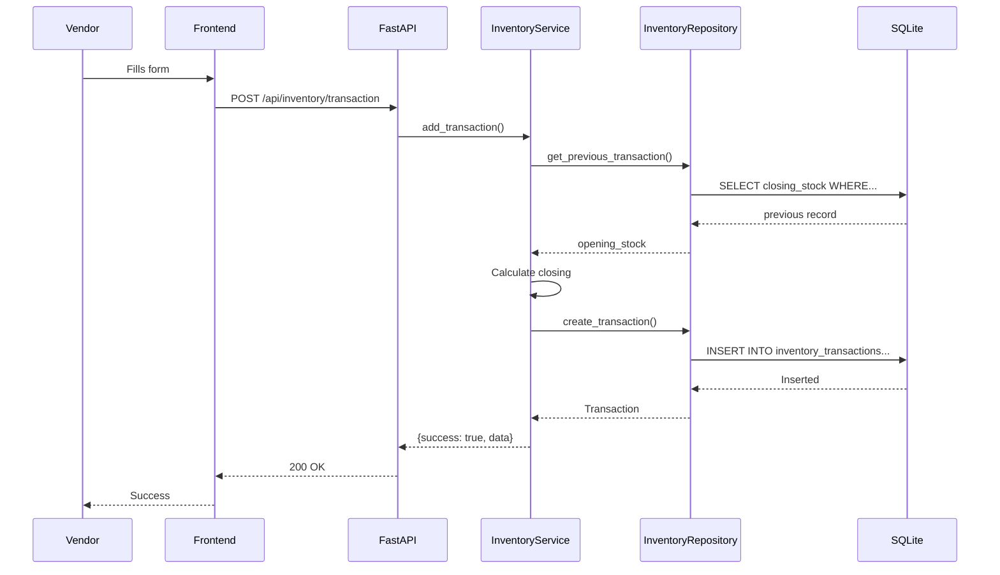
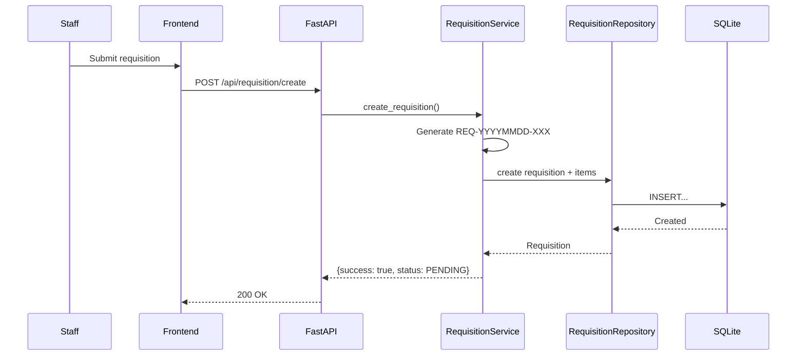
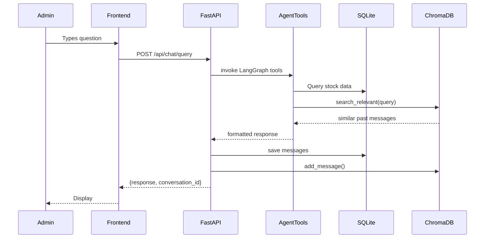

# Low Level Design (LLD)

**Project:** Smart Inventory Assistant  
**Updated:** March 20, 2026

---

## 1. Feature Overview

| Feature | Module | Description |
|---------|--------|-------------|
| **Inventory Management** | `inventory` | CRUD for locations, items, and daily transactions |
| **Requisition Management** | `requisition` | Create, approve, reject stock requisitions |
| **Analytics** | `analytics` | Dashboard charts, alerts, heatmap |
| **AI Chatbot** | `chat` | Natural language queries with LangGraph tools |

---

## 2. Database Schema

### 2.1 Locations Table

```sql
CREATE TABLE locations (
    id INTEGER PRIMARY KEY AUTOINCREMENT,
    name VARCHAR(200) NOT NULL,
    type VARCHAR(50) NOT NULL,
    region VARCHAR(100) NOT NULL,
    address TEXT,
    created_at TIMESTAMP DEFAULT CURRENT_TIMESTAMP
);
CREATE INDEX idx_locations_name ON locations(name);
CREATE INDEX idx_locations_region ON locations(region);
```

**ORM Model:** `infrastructure/database/models.py` — `Location`

### 2.2 Items Table

```sql
CREATE TABLE items (
    id INTEGER PRIMARY KEY AUTOINCREMENT,
    name VARCHAR(200) NOT NULL,
    category VARCHAR(100) NOT NULL,
    unit VARCHAR(50) NOT NULL,
    lead_time_days INTEGER NOT NULL,
    min_stock INTEGER NOT NULL,
    created_at TIMESTAMP DEFAULT CURRENT_TIMESTAMP
);
CREATE INDEX idx_items_name ON items(name);
CREATE INDEX idx_items_category ON items(category);
```

**ORM Model:** `infrastructure/database/models.py` — `Item`

### 2.3 Inventory Transactions Table

```sql
CREATE TABLE inventory_transactions (
    id INTEGER PRIMARY KEY AUTOINCREMENT,
    location_id INTEGER NOT NULL,
    item_id INTEGER NOT NULL,
    date DATE NOT NULL,
    opening_stock INTEGER NOT NULL,
    received INTEGER NOT NULL DEFAULT 0,
    issued INTEGER NOT NULL DEFAULT 0,
    closing_stock INTEGER NOT NULL,
    notes TEXT,
    entered_by VARCHAR(100) DEFAULT 'system',
    created_at TIMESTAMP DEFAULT CURRENT_TIMESTAMP,
    FOREIGN KEY (location_id) REFERENCES locations(id),
    FOREIGN KEY (item_id) REFERENCES items(id)
);
CREATE INDEX idx_transactions_date ON inventory_transactions(date);
CREATE INDEX idx_transactions_loc_item_date ON inventory_transactions(location_id, item_id, date);
```

**ORM Model:** `infrastructure/database/models.py` — `InventoryTransaction`

**Business Rule:** `closing_stock = opening_stock + received - issued`

### 2.4 Requisitions Table

```sql
CREATE TABLE requisitions (
    id INTEGER PRIMARY KEY AUTOINCREMENT,
    requisition_number VARCHAR(50) NOT NULL UNIQUE,
    location_id INTEGER NOT NULL,
    requested_by VARCHAR(100) NOT NULL,
    department VARCHAR(100) NOT NULL,
    urgency VARCHAR(20) NOT NULL DEFAULT 'NORMAL',
    status VARCHAR(20) NOT NULL DEFAULT 'PENDING',
    approved_by VARCHAR(100),
    rejection_reason TEXT,
    notes TEXT,
    created_at TIMESTAMP DEFAULT CURRENT_TIMESTAMP,
    updated_at TIMESTAMP DEFAULT CURRENT_TIMESTAMP,
    FOREIGN KEY (location_id) REFERENCES locations(id)
);
CREATE INDEX idx_requisitions_number ON requisitions(requisition_number);
CREATE INDEX idx_requisitions_status ON requisitions(status);
CREATE INDEX idx_requisitions_created ON requisitions(created_at);
```

**ORM Model:** `infrastructure/database/models.py` — `Requisition`

### 2.5 Requisition Items Table

```sql
CREATE TABLE requisition_items (
    id INTEGER PRIMARY KEY AUTOINCREMENT,
    requisition_id INTEGER NOT NULL,
    item_id INTEGER NOT NULL,
    quantity_requested INTEGER NOT NULL,
    quantity_approved INTEGER,
    notes TEXT,
    FOREIGN KEY (requisition_id) REFERENCES requisitions(id) ON DELETE CASCADE,
    FOREIGN KEY (item_id) REFERENCES items(id)
);
```

**ORM Model:** `infrastructure/database/models.py` — `RequisitionItem`

### 2.6 Chat Sessions Table

```sql
CREATE TABLE chat_sessions (
    id VARCHAR(100) PRIMARY KEY,
    user_id VARCHAR(100) DEFAULT 'admin',
    title VARCHAR(200) DEFAULT 'New Conversation',
    created_at TIMESTAMP DEFAULT CURRENT_TIMESTAMP,
    updated_at TIMESTAMP DEFAULT CURRENT_TIMESTAMP
);
CREATE INDEX idx_chat_sessions_updated ON chat_sessions(updated_at);
```

### 2.7 Chat Messages Table

```sql
CREATE TABLE chat_messages (
    id INTEGER PRIMARY KEY AUTOINCREMENT,
    session_id VARCHAR(100) NOT NULL,
    role VARCHAR(20) NOT NULL,
    content TEXT NOT NULL,
    created_at TIMESTAMP DEFAULT CURRENT_TIMESTAMP,
    FOREIGN KEY (session_id) REFERENCES chat_sessions(id) ON DELETE CASCADE
);
CREATE INDEX idx_chat_messages_session ON chat_messages(session_id);
```

---

## 3. Inventory Management Feature

### 3.1 Service

**File:** `application/inventory_service.py`

```python
class InventoryService:
    def __init__(self, repo: InventoryRepository): ...

    def add_transaction(
        self, location_id: int, item_id: int, transaction_date: date,
        received: int, issued: int, notes: Optional[str] = None,
        entered_by: str = "staff",
    ) -> Dict[str, Any]:
        # 1. Get previous closing stock (or min_stock if first)
        # 2. Calculate closing = opening + received - issued
        # 3. Validate closing >= 0
        # 4. Save transaction

    def bulk_add_transactions(...): ...
    def get_latest_stock(...) -> Optional[int]: ...
    def get_location_items(location_id: int) -> List[Dict]: ...
```

### 3.2 Repository

**File:** `infrastructure/database/inventory_repo.py`

```python
class InventoryRepository:
    def __init__(self, db: Session): ...
    def get_all_locations() -> List[Location]: ...
    def get_location_by_id(id: int) -> Optional[Location]: ...
    def get_location_by_name(name: str) -> Optional[Location]: ...
    def create_location(**kwargs) -> Location: ...
    def get_all_items() -> List[Item]: ...
    def get_item_by_id(id: int) -> Optional[Item]: ...
    def create_item(**kwargs) -> Item: ...
    def get_previous_transaction(...) -> Optional[InventoryTransaction]: ...
    def get_latest_transaction(...) -> Optional[InventoryTransaction]: ...
    def create_transaction(**kwargs) -> InventoryTransaction: ...
    def delete_all_transactions() -> int: ...
    def delete_all_items() -> int: ...
    def delete_all_locations() -> int: ...
```

### 3.3 Routes

**File:** `api/routes/inventory.py`

| Endpoint | Method | Input Schema | Output |
|----------|--------|-------------|--------|
| `/inventory/locations` | GET | — | `[{id, name, type, region}]` |
| `/inventory/items` | GET | — | `[{id, name, category, unit}]` |
| `/inventory/location/{id}/items` | GET | path: location_id | `[{item, stock, status}]` |
| `/inventory/stock/{loc}/{item}` | GET | path: location_id, item_id | `{current_stock}` |
| `/inventory/transaction` | POST | `SingleTransactionRequest` | `{success, data}` |
| `/inventory/bulk-transaction` | POST | `BulkTransactionRequest` | `{success, data}` |
| `/inventory/reset-data` | POST | `ResetDataRequest` | `{success, counts}` |

### 3.4 Schemas

**File:** `api/schemas/inventory_schemas.py`

- `TransactionItem`, `SingleTransactionRequest`, `BulkTransactionRequest`, `CreateLocationRequest`, `CreateItemRequest`, `ResetDataRequest`

---

## 4. Requisition Management Feature

### 4.1 Service

**File:** `application/requisition_service.py`

```python
class RequisitionService:
    def __init__(self, repo: RequisitionRepository, inv_repo: InventoryRepository): ...

    def create_requisition(...) -> Dict[str, Any]:
        # Generate REQ-YYYYMMDD-XXX number
        # Create requisition + items

    def approve_requisition(...) -> Dict[str, Any]:
        # Validate status == PENDING
        # Deduct stock via InventoryService
        # Update status = APPROVED

    def reject_requisition(...) -> Dict[str, Any]: ...
    def cancel_requisition(...) -> Dict[str, Any]: ...
    def list_requisitions(...) -> List[Dict]: ...
    def get_requisition(id: int) -> Optional[Dict]: ...
    def get_stats() -> Dict: ...
```

### 4.2 Repository

**File:** `infrastructure/database/requisition_repo.py`

```python
class RequisitionRepository:
    def __init__(self, db: Session): ...
    def get_by_id(id: int, load_items=False) -> Optional[Requisition]: ...
    def get_with_full_details(id: int) -> Optional[Requisition]: ...
    def list_all(status, location_id, requested_by) -> List[Requisition]: ...
    def count_by_prefix(prefix: str) -> int: ...
    def create(**kwargs) -> Requisition: ...
    def add_item(**kwargs) -> RequisitionItem: ...
    def get_location(id: int) -> Optional[Location]: ...
    def get_item(id: int) -> Optional[Item]: ...
    def count_total() -> int: ...
    def count_by_status(status: str) -> int: ...
```

### 4.3 Routes

**File:** `api/routes/requisition.py`

| Endpoint | Method | Input Schema |
|----------|--------|-------------|
| `/requisition/create` | POST | `CreateRequisitionRequest` |
| `/requisition/list` | GET | query: status, location_id, requested_by |
| `/requisition/stats` | GET | — |
| `/requisition/{id}` | GET | path: requisition_id |
| `/requisition/{id}/approve` | PUT | `ApproveRequest` |
| `/requisition/{id}/reject` | PUT | `RejectRequest` |
| `/requisition/{id}/cancel` | PUT | `CancelRequest` |

### 4.4 Schemas

**File:** `api/schemas/requisition_schemas.py`

- `RequisitionItemCreate`, `CreateRequisitionRequest`, `ApproveRequest`, `RejectRequest`, `CancelRequest`

---

## 5. Analytics Feature

### 5.1 Service

**File:** `application/analytics_service.py`

```python
class AnalyticsService:
    @staticmethod
    def get_heatmap(db: Session) -> Dict[str, Any]:
        # Queries stock_health via infrastructure/database/queries.py
        # Returns locations[], items[], matrix[][], details[]

    @staticmethod
    def get_alerts(db: Session, severity: str) -> Dict[str, Any]:
        # Returns formatted critical/warning items with reorder suggestions

    @staticmethod
    def get_summary(db: Session) -> Dict[str, Any]:
        # Returns overview counts, health summary, categories breakdown

    @staticmethod
    def get_dashboard_stats(db: Session) -> Dict[str, Any]:
        # Returns chart data: category_distribution, low_stock, location_stock, status_distribution
```

### 5.2 Complex Queries

**File:** `infrastructure/database/queries.py`

| Function | Returns |
|----------|---------|
| `get_latest_stock_health(db)` | Latest stock health for all location/item combinations |
| `get_critical_alerts(db, severity)` | Critical or warning items sorted by days remaining |
| `get_heatmap_data(db)` | Matrix structure for heatmap visualization |

### 5.3 Routes

**File:** `api/routes/analytics.py`

| Endpoint | Method |
|----------|--------|
| `/analytics/heatmap` | GET |
| `/analytics/alerts?severity=` | GET |
| `/analytics/summary` | GET |
| `/analytics/dashboard/stats` | GET |

---

## 6. AI Chatbot Feature

### 6.1 Agent Tools

**File:** `application/agent_tools.py`

LangGraph `@tool` wrappers around DB queries:

| Tool | Function | Returns |
|------|----------|---------|
| `get_inventory_overview` | Total counts | Dict |
| `get_critical_items` | Items below threshold | List[Dict] |
| `get_stock_health` | Detailed health data | List[Dict] |
| `calculate_reorder_suggestions` | Reorder recommendations | List[Dict] |
| `get_location_summary` | Location-specific data | Dict |
| `get_category_analysis` | Category breakdown | List[Dict] |
| `get_consumption_trends` | Usage patterns over time | Dict |

### 6.2 Vector Memory

**File:** `infrastructure/vector_store/vector_store.py`

```python
class VectorMemory:
    def add_message(session_id, role, content, timestamp): ...
    def search_relevant(query, n_results=5, exclude_session=None) -> List[Dict]: ...
    def get_stats() -> Dict: ...
```

### 6.3 Routes

**File:** `api/routes/chat.py`

| Endpoint | Method |
|----------|--------|
| `/chat/query` | POST |
| `/chat/history/{id}` | GET |
| `/chat/history/{id}` | DELETE |
| `/chat/suggestions` | GET |
| `/chat/sessions` | GET |
| `/chat/transcribe` | POST |

### 6.4 Schemas

**File:** `api/schemas/chat_schemas.py`

- `ChatRequest`, `ChatResponse`

---

## 7. Sequence Diagrams

### 7.1 Add Inventory Transaction



### 7.2 Create Requisition



### 7.3 AI Chat Query



---

## 8. Error Handling

### 8.1 Exception Hierarchy

**File:** `core/exceptions.py`

| Exception | HTTP Code | When |
|-----------|-----------|------|
| `AppException` | 500 | Base |
| `NotFoundError` | 404 | Resource not found |
| `ValidationError` | 422 | Validation failed |
| `InsufficientStockError` | 400 | Stock too low |
| `DuplicateError` | 409 | Already exists |
| `InvalidStateError` | 400 | Invalid state transition |
| `AuthenticationError` | 401 | Unauthorized |
| `AuthorizationError` | 403 | Forbidden |

### 8.2 Global Handler

**File:** `core/error_handlers.py` — maps exceptions to consistent JSON response shape.

---

## 9. Edge Cases

| Feature | Scenario | Behavior |
|---------|----------|----------|
| **Inventory** | First transaction for item/location | Uses `min_stock` as opening stock |
| **Inventory** | Negative closing stock | Reject with 400 error |
| **Inventory** | No transaction data | Returns 0 stock |
| **Requisition** | Approve already approved | Reject with 400 |
| **Requisition** | Approve > available stock | Reject with stock error |
| **Requisition** | Cancel non-PENDING | Reject with 400 |
| **Chat** | No Groq API key | Uses fallback rule-based responses |
| **Chat** | ChromaDB unavailable | Continues without semantic memory |
| **Analytics** | No transaction data | Returns empty charts with info message |

---

## 10. File Reference

| File | Purpose |
|------|---------|
| `app/main.py` | FastAPI app bootstrap |
| `app/core/config.py` | Settings from .env |
| `app/core/dependencies.py` | FastAPI DI factories |
| `app/core/exceptions.py` | Custom exception classes |
| `app/core/error_handlers.py` | Global exception → HTTP handlers |
| `app/core/logging_config.py` | Structured logging setup |
| `app/core/middleware/request_logger.py` | Request/response logging |
| `app/api/routes/inventory.py` | Inventory API endpoints |
| `app/api/routes/requisition.py` | Requisition API endpoints |
| `app/api/routes/analytics.py` | Analytics API endpoints |
| `app/api/routes/chat.py` | Chat API endpoints |
| `app/api/schemas/inventory_schemas.py` | Inventory Pydantic models |
| `app/api/schemas/requisition_schemas.py` | Requisition Pydantic models |
| `app/api/schemas/chat_schemas.py` | Chat Pydantic models |
| `app/application/inventory_service.py` | Inventory business logic |
| `app/application/requisition_service.py` | Requisition business logic |
| `app/application/analytics_service.py` | Analytics computation |
| `app/application/agent_tools.py` | LangGraph @tool functions |
| `app/domain/calculations.py` | Pure stock formulas |
| `app/domain/agent/prompts.py` | System prompt text |
| `app/infrastructure/database/connection.py` | SQLAlchemy engine/session |
| `app/infrastructure/database/models.py` | ORM model classes |
| `app/infrastructure/database/queries.py` | Complex SQL queries |
| `app/infrastructure/database/inventory_repo.py` | Inventory data access |
| `app/infrastructure/database/requisition_repo.py` | Requisition data access |
| `app/infrastructure/vector_store/vector_store.py` | ChromaDB semantic memory |
| `database/schema.sql` | Database schema reference |
| `database/seed_data.py` | Sample data population |
