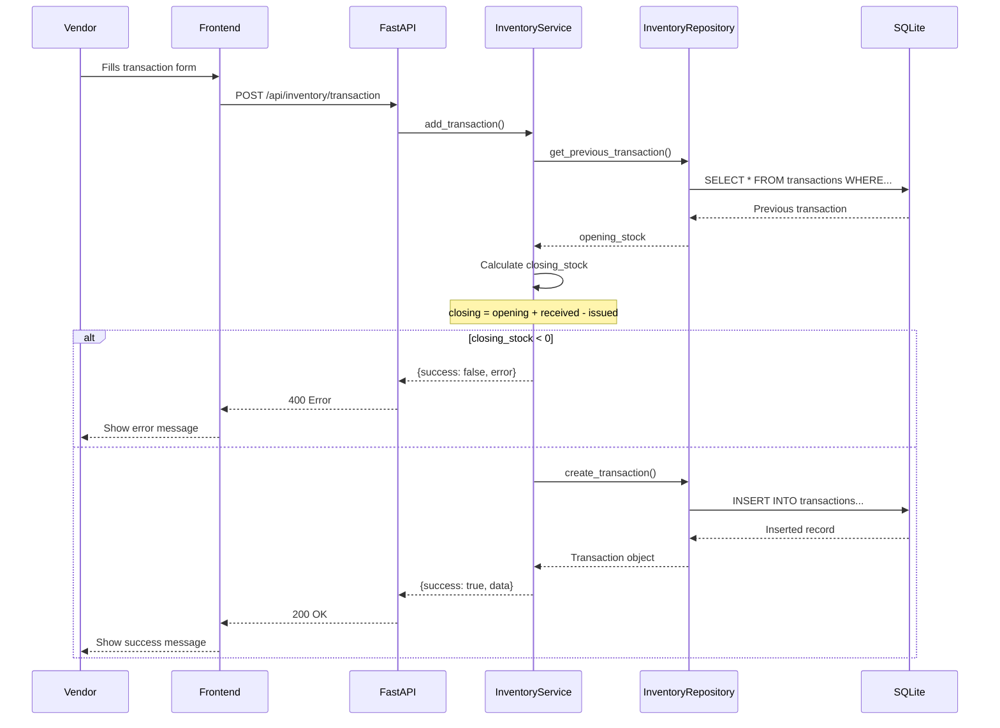
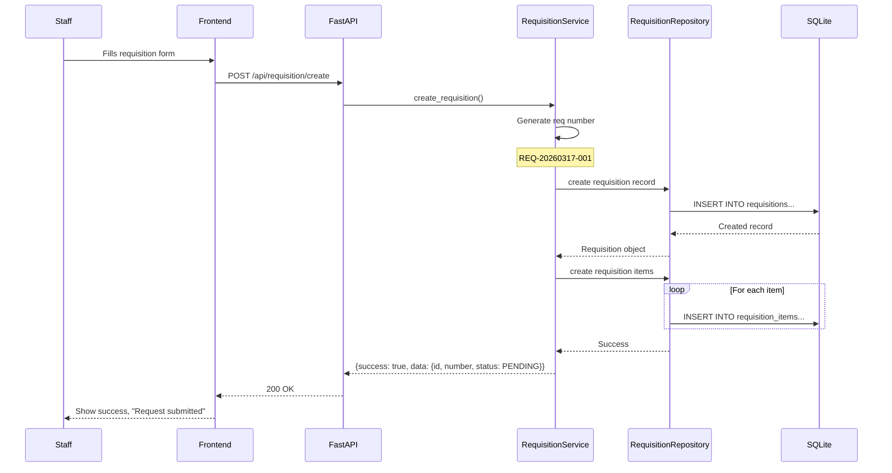
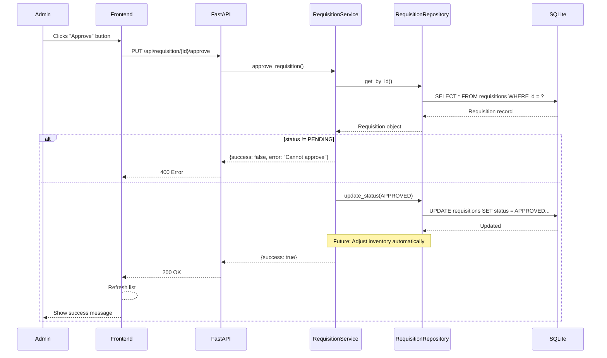
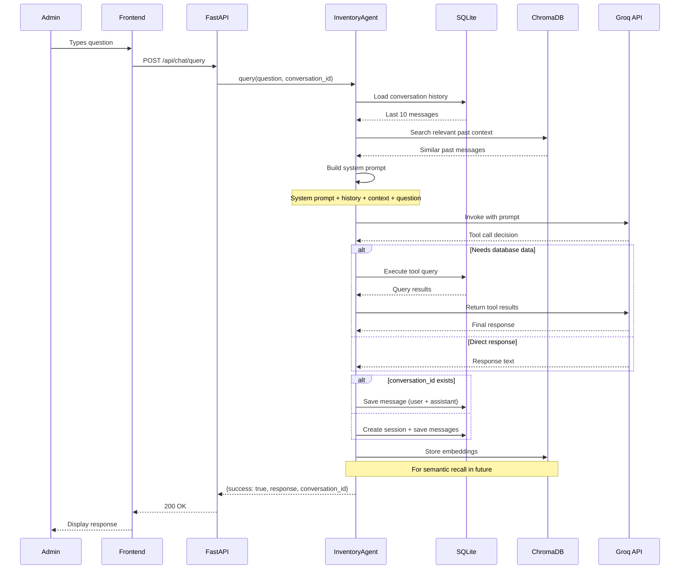
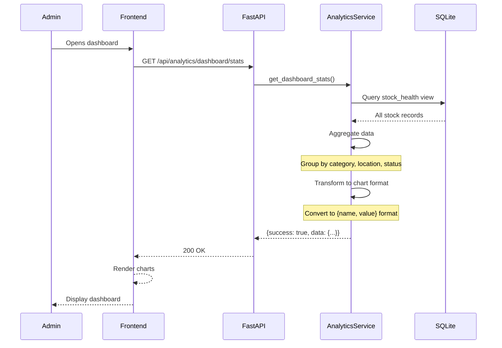

# Low Level Design (LLD) Document

**Project:** Smart Inventory Assistant  
**Date:** March 17, 2026

---

## Table of Contents

1. [Feature Overview](#1-feature-overview)
2. [Database Schema](#2-database-schema)
3. [Inventory Management Feature](#3-inventory-management-feature)
4. [Requisition Management Feature](#4-requisition-management-feature)
5. [Analytics Feature](#5-analytics-feature)
6. [AI Chatbot Feature](#6-ai-chatbot-feature)
7. [Sequence Diagrams](#7-sequence-diagrams)
8. [Error Handling](#8-error-handling)
9. [Edge Cases](#9-edge-cases)

---

## 1. Feature Overview

| Feature | Module | Description |
|---------|--------|-------------|
| **Inventory Management** | `inventory` | CRUD for locations, items, and daily transactions |
| **Requisition Management** | `requisition` | Create, approve, reject stock requisitions |
| **Analytics** | `analytics` | Dashboard charts, alerts, heatmap |
| **AI Chatbot** | `chat` | Natural language queries with LangGraph |

---

## 2. Database Schema

### 2.1 Locations Table

```sql
CREATE TABLE locations (
    id INTEGER PRIMARY KEY AUTOINCREMENT,
    name VARCHAR(200) NOT NULL,
    type VARCHAR(50) NOT NULL,          -- 'HOSPITAL', 'CLINIC', 'WAREHOUSE'
    region VARCHAR(100) NOT NULL,
    address TEXT,
    created_at TIMESTAMP DEFAULT CURRENT_TIMESTAMP
);

-- Indexes
CREATE INDEX idx_locations_name ON locations(name);
CREATE INDEX idx_locations_region ON locations(region);
```

**ORM Model:** `backend/app/database/models.py` - `Location` class

| Column | Type | Constraints | Description |
|--------|------|-------------|-------------|
| `id` | INTEGER | PK, AUTOINCREMENT | Primary key |
| `name` | VARCHAR(200) | NOT NULL | Location name |
| `type` | VARCHAR(50) | NOT NULL | HOSPITAL, CLINIC, WAREHOUSE |
| `region` | VARCHAR(100) | NOT NULL | Geographic region |
| `address` | TEXT | NULLABLE | Full address |
| `created_at` | TIMESTAMP | DEFAULT CURRENT_TIMESTAMP | Creation timestamp |

---

### 2.2 Items Table

```sql
CREATE TABLE items (
    id INTEGER PRIMARY KEY AUTOINCREMENT,
    name VARCHAR(200) NOT NULL,
    category VARCHAR(100) NOT NULL,     -- 'Medicine', 'Supply', 'Equipment'
    unit VARCHAR(50) NOT NULL,          -- 'tablets', 'pieces', 'liters'
    lead_time_days INTEGER NOT NULL,    -- Days to reorder
    min_stock INTEGER NOT NULL,         -- Minimum stock threshold
    created_at TIMESTAMP DEFAULT CURRENT_TIMESTAMP
);

-- Indexes
CREATE INDEX idx_items_name ON items(name);
CREATE INDEX idx_items_category ON items(category);
```

**ORM Model:** `backend/app/database/models.py` - `Item` class

| Column | Type | Constraints | Description |
|--------|------|-------------|-------------|
| `id` | INTEGER | PK, AUTOINCREMENT | Primary key |
| `name` | VARCHAR(200) | NOT NULL | Item name |
| `category` | VARCHAR(100) | NOT NULL | Category classification |
| `unit` | VARCHAR(50) | NOT NULL | Unit of measurement |
| `lead_time_days` | INTEGER | NOT NULL | Reorder lead time |
| `min_stock` | INTEGER | NOT NULL | Minimum stock threshold |
| `created_at` | TIMESTAMP | DEFAULT CURRENT_TIMESTAMP | Creation timestamp |

---

### 2.3 Inventory Transactions Table

```sql
CREATE TABLE inventory_transactions (
    id INTEGER PRIMARY KEY AUTOINCREMENT,
    location_id INTEGER NOT NULL,
    item_id INTEGER NOT NULL,
    date DATE NOT NULL,
    opening_stock INTEGER NOT NULL,
    received INTEGER NOT NULL DEFAULT 0,
    issued INTEGER NOT NULL DEFAULT 0,
    closing_stock INTEGER NOT NULL,
    notes TEXT,
    entered_by VARCHAR(100) DEFAULT 'system',
    created_at TIMESTAMP DEFAULT CURRENT_TIMESTAMP,
    FOREIGN KEY (location_id) REFERENCES locations(id),
    FOREIGN KEY (item_id) REFERENCES items(id)
);

-- Indexes
CREATE INDEX idx_transactions_date ON inventory_transactions(date);
CREATE INDEX idx_transactions_location ON inventory_transactions(location_id);
CREATE INDEX idx_transactions_item ON inventory_transactions(item_id);
CREATE INDEX idx_transactions_loc_item_date ON inventory_transactions(location_id, item_id, date);
```

**ORM Model:** `backend/app/database/models.py` - `InventoryTransaction` class

| Column | Type | Constraints | Description |
|--------|------|-------------|-------------|
| `id` | INTEGER | PK, AUTOINCREMENT | Primary key |
| `location_id` | INTEGER | FK → locations(id) | Foreign key to location |
| `item_id` | INTEGER | FK → items(id) | Foreign key to item |
| `date` | DATE | NOT NULL | Transaction date |
| `opening_stock` | INTEGER | NOT NULL | Stock at day start |
| `received` | INTEGER | NOT NULL, DEFAULT 0 | Stock received |
| `issued` | INTEGER | NOT NULL, DEFAULT 0 | Stock issued |
| `closing_stock` | INTEGER | NOT NULL | Stock at day end |
| `notes` | TEXT | NULLABLE | Optional notes |
| `entered_by` | VARCHAR(100) | DEFAULT 'system' | User who entered |
| `created_at` | TIMESTAMP | DEFAULT CURRENT_TIMESTAMP | Creation timestamp |

**Business Rule:** `closing_stock = opening_stock + received - issued`

---

### 2.4 Requisitions Table

```sql
CREATE TABLE requisitions (
    id INTEGER PRIMARY KEY AUTOINCREMENT,
    requisition_number VARCHAR(50) NOT NULL UNIQUE,
    location_id INTEGER NOT NULL,
    requested_by VARCHAR(100) NOT NULL,
    department VARCHAR(100) NOT NULL,
    urgency VARCHAR(20) NOT NULL DEFAULT 'NORMAL',  -- 'LOW', 'NORMAL', 'HIGH', 'EMERGENCY'
    status VARCHAR(20) NOT NULL DEFAULT 'PENDING', -- 'PENDING', 'APPROVED', 'REJECTED', 'CANCELLED'
    approved_by VARCHAR(100),
    rejection_reason TEXT,
    notes TEXT,
    created_at TIMESTAMP DEFAULT CURRENT_TIMESTAMP,
    updated_at TIMESTAMP DEFAULT CURRENT_TIMESTAMP,
    FOREIGN KEY (location_id) REFERENCES locations(id)
);

-- Indexes
CREATE INDEX idx_requisitions_number ON requisitions(requisition_number);
CREATE INDEX idx_requisitions_status ON requisitions(status);
CREATE INDEX idx_requisitions_location ON requisitions(location_id);
CREATE INDEX idx_requisitions_created ON requisitions(created_at);
```

**ORM Model:** `backend/app/database/models.py` - `Requisition` class

| Column | Type | Constraints | Description |
|--------|------|-------------|-------------|
| `id` | INTEGER | PK, AUTOINCREMENT | Primary key |
| `requisition_number` | VARCHAR(50) | NOT NULL, UNIQUE | Human-readable ID (REQ-YYYYMMDD-XXX) |
| `location_id` | INTEGER | FK → locations(id) | Requesting location |
| `requested_by` | VARCHAR(100) | NOT NULL | Staff name |
| `department` | VARCHAR(100) | NOT NULL | Department |
| `urgency` | VARCHAR(20) | NOT NULL, DEFAULT 'NORMAL' | Urgency level |
| `status` | VARCHAR(20) | NOT NULL, DEFAULT 'PENDING' | Current status |
| `approved_by` | VARCHAR(100) | NULLABLE | Admin who approved |
| `rejection_reason` | TEXT | NULLABLE | Reason if rejected |
| `notes` | TEXT | NULLABLE | Additional notes |
| `created_at` | TIMESTAMP | DEFAULT CURRENT_TIMESTAMP | Creation timestamp |
| `updated_at` | TIMESTAMP | DEFAULT CURRENT_TIMESTAMP | Last update |

---

### 2.5 Requisition Items Table

```sql
CREATE TABLE requisition_items (
    id INTEGER PRIMARY KEY AUTOINCREMENT,
    requisition_id INTEGER NOT NULL,
    item_id INTEGER NOT NULL,
    quantity_requested INTEGER NOT NULL,
    quantity_approved INTEGER,
    notes TEXT,
    FOREIGN KEY (requisition_id) REFERENCES requisitions(id) ON DELETE CASCADE,
    FOREIGN KEY (item_id) REFERENCES items(id)
);

-- Indexes
CREATE INDEX idx_requisition_items_req ON requisition_items(requisition_id);
CREATE INDEX idx_requisition_items_item ON requisition_items(item_id);
```

**ORM Model:** `backend/app/database/models.py` - `RequisitionItem` class

| Column | Type | Constraints | Description |
|--------|------|-------------|-------------|
| `id` | INTEGER | PK, AUTOINCREMENT | Primary key |
| `requisition_id` | INTEGER | FK → requisitions(id), CASCADE DELETE | Parent requisition |
| `item_id` | INTEGER | FK → items(id) | Requested item |
| `quantity_requested` | INTEGER | NOT NULL | Quantity requested |
| `quantity_approved` | INTEGER | NULLABLE | Quantity approved (filled by admin) |
| `notes` | TEXT | NULLABLE | Item-specific notes |

---

### 2.6 Chat Sessions Table

```sql
CREATE TABLE chat_sessions (
    id VARCHAR(100) PRIMARY KEY,  -- UUID or custom ID
    user_id VARCHAR(100) DEFAULT 'admin',
    title VARCHAR(200) DEFAULT 'New Conversation',
    created_at TIMESTAMP DEFAULT CURRENT_TIMESTAMP,
    updated_at TIMESTAMP DEFAULT CURRENT_TIMESTAMP
);

CREATE INDEX idx_chat_sessions_user ON chat_sessions(user_id);
CREATE INDEX idx_chat_sessions_updated ON chat_sessions(updated_at);
```

**ORM Model:** `backend/app/database/models.py` - `ChatSession` class

---

### 2.7 Chat Messages Table

```sql
CREATE TABLE chat_messages (
    id INTEGER PRIMARY KEY AUTOINCREMENT,
    session_id VARCHAR(100) NOT NULL,
    role VARCHAR(20) NOT NULL,          -- 'user', 'assistant'
    content TEXT NOT NULL,
    created_at TIMESTAMP DEFAULT CURRENT_TIMESTAMP,
    FOREIGN KEY (session_id) REFERENCES chat_sessions(id) ON DELETE CASCADE
);

CREATE INDEX idx_chat_messages_session ON chat_messages(session_id);
CREATE INDEX idx_chat_messages_created ON chat_messages(created_at);
```

**ORM Model:** `backend/app/database/models.py` - `ChatMessage` class

---

### 2.8 Stock Health View

```sql
CREATE VIEW stock_health AS
SELECT 
    t.location_id,
    t.item_id,
    l.name as location_name,
    i.name as item_name,
    i.category,
    t.closing_stock as current_stock,
    i.min_stock,
    i.lead_time_days,
    AVG(t.issued) OVER (
        PARTITION BY t.location_id, t.item_id 
        ORDER BY t.date 
        ROWS BETWEEN 6 PRECEDING AND CURRENT ROW
    ) as avg_daily_usage,
    CASE 
        WHEN AVG(t.issued) OVER (
            PARTITION BY t.location_id, t.item_id 
            ORDER BY t.date 
            ROWS BETWEEN 6 PRECEDING AND CURRENT ROW
        ) > 0 
        THEN t.closing_stock / AVG(t.issued) OVER (
            PARTITION BY t.location_id, t.item_id 
            ORDER BY t.date 
            ROWS BETWEEN 6 PRECEDING AND CURRENT ROW
        )
        ELSE 999
    END as days_remaining,
    CASE 
        WHEN (
            CASE 
                WHEN AVG(t.issued) OVER (
                    PARTITION BY t.location_id, t.item_id 
                    ORDER BY t.date 
                    ROWS BETWEEN 6 PRECEDING AND CURRENT ROW
                ) > 0 
                THEN t.closing_stock / AVG(t.issued) OVER (
                    PARTITION BY t.location_id, t.item_id 
                    ORDER BY t.date 
                    ROWS BETWEEN 6 PRECEDING AND CURRENT ROW
                )
                ELSE 999
            END
        ) < 3 THEN 'CRITICAL'
        WHEN (
            CASE 
                WHEN AVG(t.issued) OVER (
                    PARTITION BY t.location_id, t.item_id 
                    ORDER BY t.date 
                    ROWS BETWEEN 6 PRECEDING AND CURRENT ROW
                ) > 0 
                THEN t.closing_stock / AVG(t.issued) OVER (
                    PARTITION BY t.location_id, t.item_id 
                    ORDER BY t.date 
                    ROWS BETWEEN 6 PRECEDING AND CURRENT ROW
                )
                ELSE 999
            END
        ) BETWEEN 3 AND 7 THEN 'WARNING'
        ELSE 'HEALTHY'
    END as health_status,
    t.date as last_updated
FROM inventory_transactions t
JOIN locations l ON t.location_id = l.id
JOIN items i ON t.item_id = i.id;
```

---

## 3. Inventory Management Feature

### 3.1 Service Class Design

**File:** `backend/app/services/inventory_service.py`

```python
class InventoryService:
    """Business logic for inventory transactions."""
    
    def __init__(self, repo: InventoryRepository):
        self.repo = repo
    
    def add_transaction(
        self,
        location_id: int,
        item_id: int,
        transaction_date: date,
        received: int,
        issued: int,
        notes: Optional[str] = None,
        entered_by: str = "staff",
    ) -> Dict[str, Any]:
        """
        Add a new inventory transaction.
        
        Flow:
        1. Get previous day's closing stock
        2. Calculate opening_stock = previous.closing_stock (or min_stock if no history)
        3. Calculate closing_stock = opening + received - issued
        4. Validate closing_stock >= 0
        5. Save transaction
        
        Returns:
            Dict with success status and transaction data
        """
    
    def bulk_add_transactions(
        self,
        location_id: int,
        transaction_date: date,
        items_data: List[Dict],
        entered_by: str = "staff",
    ) -> Dict[str, Any]:
        """Add multiple transactions in one batch."""
    
    def get_latest_stock(self, location_id: int, item_id: int) -> Optional[int]:
        """Get most recent closing stock for an item at a location."""
    
    def get_location_items(self, location_id: int) -> List[Dict]:
        """Get all items for a location with stock status."""
```

### 3.2 Repository Class Design

**File:** `backend/app/repositories/inventory_repo.py`

```python
class InventoryRepository:
    """Data access layer for inventory."""
    
    def __init__(self, db: Session):
        self.db = db
    
    # Locations
    def get_all_locations(self) -> List[Location]: ...
    def get_location_by_id(self, location_id: int) -> Optional[Location]: ...
    def create_location(self, **kwargs) -> Location: ...
    
    # Items
    def get_all_items(self) -> List[Item]: ...
    def get_item_by_id(self, item_id: int) -> Optional[Item]: ...
    def create_item(self, **kwargs) -> Item: ...
    
    # Transactions
    def get_previous_transaction(
        self, location_id: int, item_id: int, before_date: date
    ) -> Optional[InventoryTransaction]: ...
    
    def get_latest_transaction(
        self, location_id: int, item_id: int
    ) -> Optional[InventoryTransaction]: ...
    
    def create_transaction(self, **kwargs) -> InventoryTransaction: ...
```

### 3.3 API Routes

**File:** `backend/app/api/routes/inventory.py`

| Endpoint | Method | Handler | Input Schema | Output Schema |
|----------|--------|---------|--------------|---------------|
| `/inventory/locations` | GET | `get_locations` | - | `LocationListResponse` |
| `/inventory/items` | GET | `get_items` | - | `ItemListResponse` |
| `/inventory/location/{id}/items` | GET | `get_location_items` | location_id (path) | `LocationItemsResponse` |
| `/inventory/stock/{location_id}/{item_id}` | GET | `get_stock` | location_id, item_id (path) | `StockResponse` |
| `/inventory/transaction` | POST | `add_transaction` | `TransactionRequest` | `TransactionResponse` |
| `/inventory/bulk-transaction` | POST | `bulk_add_transactions` | `BulkTransactionRequest` | `BulkTransactionResponse` |
| `/inventory/reset-data` | POST | `reset_data` | - | `ResetResponse` |

---

## 4. Requisition Management Feature

### 4.1 Service Class Design

**File:** `backend/app/services/requisition_service.py`

```python
class RequisitionService:
    """Business logic for requisitions."""
    
    def __init__(self, repo: RequisitionRepository, db: Session):
        self.repo = repo
        self.db = db
    
    def create_requisition(
        self,
        location_id: int,
        requested_by: str,
        department: str,
        urgency: str,
        items: List[Dict],
        notes: Optional[str] = None,
    ) -> Dict[str, Any]:
        """
        Create a new requisition.
        
        Flow:
        1. Generate requisition number (REQ-YYYYMMDD-XXX)
        2. Create Requisition record with PENDING status
        3. Create RequisitionItem records
        4. Commit to database
        
        Returns:
            Dict with success status and created requisition
        """
    
    def approve_requisition(
        self,
        requisition_id: int,
        approved_by: str,
        notes: Optional[str] = None,
    ) -> Dict[str, Any]:
        """
        Approve a requisition.
        
        Flow:
        1. Load requisition (must exist)
        2. Validate status is PENDING
        3. Update status to APPROVED
        4. Set approved_by timestamp
        5. (Future) Adjust inventory automatically
        
        Returns:
            Dict with success status
        """
    
    def reject_requisition(
        self,
        requisition_id: int,
        rejected_by: str,
        reason: str,
    ) -> Dict[str, Any]:
        """Reject a requisition with reason."""
    
    def cancel_requisition(
        self,
        requisition_id: int,
        cancelled_by: str,
    ) -> Dict[str, Any]:
        """Cancel a pending requisition."""
    
    def get_requisition(self, requisition_id: int) -> Dict[str, Any]: ...
    
    def list_requisitions(
        self,
        status: Optional[str] = None,
        location_id: Optional[int] = None,
    ) -> List[Dict]: ...
    
    def get_stats(self) -> Dict[str, Any]:
        """Get requisition statistics."""
```

### 4.2 Repository Class Design

**File:** `backend/app/repositories/requisition_repo.py`

```python
class RequisitionRepository:
    """Data access for requisitions."""
    
    def __init__(self, db: Session):
        self.db = db
    
    def create(self, **kwargs) -> Requisition: ...
    def get_by_id(self, requisition_id: int) -> Optional[Requisition]: ...
    def get_by_number(self, requisition_number: str) -> Optional[Requisition]: ...
    def update_status(self, requisition_id: int, status: str) -> None: ...
    def list_all(self, **filters) -> List[Requisition]: ...
    def count_by_status(self) -> Dict[str, int>: ...
```

### 4.3 API Routes

**File:** `backend/app/api/routes/requisition.py`

| Endpoint | Method | Handler | Description |
|----------|--------|---------|-------------|
| `/requisition/create` | POST | `create_requisition` | Create new requisition |
| `/requisition/list` | GET | `list_requisitions` | List with filters |
| `/requisition/{id}` | GET | `get_requisition` | Get single requisition |
| `/requisition/stats` | GET | `get_stats` | Statistics |
| `/requisition/{id}/approve` | PUT | `approve_requisition` | Approve |
| `/requisition/{id}/reject` | PUT | `reject_requisition` | Reject with reason |
| `/requisition/{id}/cancel` | PUT | `cancel_requisition` | Cancel |

---

## 5. Analytics Feature

### 5.1 Service Class Design

**File:** `backend/app/services/analytics_service.py`

```python
class AnalyticsService:
    """Analytics and reporting."""
    
    @staticmethod
    def get_heatmap(db: Session) -> Dict[str, Any]:
        """
        Generate heatmap data for location/item matrix.
        
        Returns:
            {
                "locations": [...],
                "items": [...],
                "matrix": [[status, ...], ...],
                "details": [...]
            }
        """
    
    @staticmethod
    def get_alerts(db: Session, severity: str = "CRITICAL") -> Dict[str, Any]:
        """Get critical or warning stock alerts."""
    
    @staticmethod
    def get_summary(db: Session) -> Dict[str, Any]:
        """Overall statistics summary."""
    
    @staticmethod
    def get_dashboard_stats(db: Session) -> Dict[str, Any]:
        """Dashboard chart data."""
```

### 5.2 API Routes

**File:** `backend/app/api/routes/analytics.py`

| Endpoint | Method | Handler | Description |
|----------|--------|---------|-------------|
| `/analytics/heatmap` | GET | `get_heatmap` | Stock heatmap |
| `/analytics/alerts` | GET | `get_alerts` | Critical alerts |
| `/analytics/summary` | GET | `get_summary` | Summary stats |
| `/analytics/dashboard/stats` | GET | `get_dashboard_stats` | Chart data |

---

## 6. AI Chatbot Feature

### 6.1 Agent Class Design

**File:** `backend/app/services/ai_agent/agent.py`

```python
class InventoryAgent:
    """LangGraph-based AI agent for inventory queries."""
    
    def __init__(self, db: Session):
        self.db = db
        set_db_session(db)  # Set DB for tools
    
    def query(self, question: str, conversation_id: str = None) -> Dict[str, Any]:
        """
        Process a user question.
        
        Flow:
        1. Load conversation history from SQLite
        2. Search ChromaDB for relevant past context
        3. Build system prompt with context
        4. Invoke LangGraph workflow
        5. Return response
        6. Save to SQLite and ChromaDB
        """
    
    def _get_conversation_history(
        self, conversation_id: str, limit: int = 10
    ) -> List[Any]:
        """Get recent messages for context."""
    
    def _fallback_response(self, question_lower: str) -> str:
        """Rule-based fallback when LLM unavailable."""
```

### 6.2 AI Tools

**File:** `backend/app/services/ai_agent/tools.py`

| Tool | Function | Returns |
|------|----------|---------|
| `get_inventory_overview` | Overall inventory status | Dict |
| `get_critical_items` | Items below threshold | List[Dict] |
| `get_stock_health` | Detailed health data | List[Dict] |
| `calculate_reorder_suggestions` | Reorder recommendations | List[Dict] |
| `get_location_summary` | Location-specific data | Dict |
| `get_category_analysis` | Category breakdown | Dict |
| `get_consumption_trends` | Usage patterns | List[Dict] |

### 6.3 Vector Memory

**File:** `backend/app/services/memory/vector_store.py`

```python
class VectorMemory:
    """ChromaDB-backed semantic memory."""
    
    def add_message(
        self,
        session_id: str,
        role: str,
        content: str,
        timestamp: datetime = None,
    ) -> None:
        """Store message with embedding."""
    
    def search_relevant(
        self,
        query: str,
        n_results: int = 5,
        exclude_session: str = None,
    ) -> List[Dict]:
        """Semantic search for relevant past messages."""
```

### 6.4 API Routes

**File:** `backend/app/api/routes/chat.py`

| Endpoint | Method | Handler | Description |
|----------|--------|---------|-------------|
| `/chat/query` | POST | `chat_query` | Send question to AI |
| `/chat/history/{id}` | GET | `get_chat_history` | Get conversation |
| `/chat/history/{id}` | DELETE | `clear_chat_history` | Delete conversation |
| `/chat/suggestions` | GET | `get_question_suggestions` | Suggested questions |
| `/chat/sessions` | GET | `get_chat_sessions` | List conversations |
| `/chat/transcribe` | POST | `transcribe_audio` | Audio to text |

---

## 7. Sequence Diagrams

### 7.1 Add Inventory Transaction



### 7.2 Create Requisition



### 7.3 Approve Requisition



### 7.4 AI Chat Query



### 7.5 Analytics Dashboard



---

## 8. Error Handling

### 8.1 Exception Hierarchy

```python
# backend/app/core/exceptions.py

class AppException(Exception):
    """Base application exception."""
    status_code: int = 500
    error_code: str = "INTERNAL_ERROR"

class NotFoundError(AppException):
    status_code = 404
    error_code = "NOT_FOUND"

class ValidationError(AppException):
    status_code = 422
    error_code = "VALIDATION_ERROR"

class InsufficientStockError(AppException):
    status_code = 400
    error_code = "INSUFFICIENT_STOCK"

class DuplicateError(AppException):
    status_code = 409
    error_code = "DUPLICATE"

class InvalidStateError(AppException):
    status_code = 400
    error_code = "INVALID_STATE"

class AuthenticationError(AppException):
    status_code = 401
    error_code = "AUTHENTICATION_ERROR"

class AuthorizationError(AppException):
    status_code = 403
    error_code = "AUTHORIZATION_ERROR"
```

### 8.2 Global Error Handler

**File:** `backend/app/core/error_handlers.py`

| Exception | HTTP Code | Response |
|-----------|-----------|----------|
| `NotFoundError` | 404 | `{success: false, error: "Resource not found"}` |
| `ValidationError` | 422 | `{success: false, error: "Validation failed"}` |
| `InsufficientStockError` | 400 | `{success: false, error: "Not enough stock"}` |
| `DuplicateError` | 409 | `{success: false, error: "Already exists"}` |
| `InvalidStateError` | 400 | `{success: false, error: "Invalid state"}` |
| `AuthenticationError` | 401 | `{success: false, error: "Unauthorized"}` |
| `AuthorizationError` | 403 | `{success: false, error: "Forbidden"}` |
| `AppException` | 500 | `{success: false, error: "Internal error"}` |

---

## 9. Edge Cases

### 9.1 Inventory Transactions

| Scenario | Expected Behavior |
|----------|-------------------|
| First transaction for item/location | Use `min_stock` as opening stock |
| Negative closing_stock | Reject with 400 error |
| Transaction for future date | Allow (for planning) |
| Transaction for past date | Allow (for corrections) |
| Duplicate date/location/item | Create new record (append) |
| Missing previous day data | Use min_stock as fallback |

### 9.2 Requisitions

| Scenario | Expected Behavior |
|----------|-------------------|
| Approve already approved | Reject with 400 error |
| Reject already rejected | Reject with 400 error |
| Cancel non-pending | Reject with 400 error |
| Requisition with 0 items | Reject with validation error |
| Negative quantity | Reject with validation error |
| Approve more than requested | Allow (admin discretion) |
| Location doesn't exist | Reject with 404 error |

### 9.3 AI Chat

| Scenario | Expected Behavior |
|----------|-------------------|
| No Groq API key | Use fallback rule-based responses |
| Empty question | Reject with 422 validation error |
| Very long question | Truncate or reject (>1000 chars) |
| ChromaDB unavailable | Continue without semantic memory |
| LLM timeout | Return fallback response |
| Invalid conversation ID | Create new session |

### 9.4 Analytics

| Scenario | Expected Behavior |
|----------|-------------------|
| No transaction data | Return empty charts with message |
| Single day of data | Show limited trends |
| Future dates in view | Exclude from calculations |

---

## 10. File Reference

| File | Purpose |
|------|---------|
| `backend/app/main.py` | FastAPI app setup |
| `backend/app/config.py` | Configuration |
| `backend/app/api/routes/inventory.py` | Inventory API |
| `backend/app/api/routes/requisition.py` | Requisition API |
| `backend/app/api/routes/analytics.py` | Analytics API |
| `backend/app/api/routes/chat.py` | Chat API |
| `backend/app/services/inventory_service.py` | Inventory logic |
| `backend/app/services/requisition_service.py` | Requisition logic |
| `backend/app/services/analytics_service.py` | Analytics logic |
| `backend/app/services/ai_agent/agent.py` | AI agent |
| `backend/app/services/ai_agent/tools.py` | AI tools |
| `backend/app/services/memory/vector_store.py` | Vector memory |
| `backend/app/repositories/inventory_repo.py` | Inventory data access |
| `backend/app/repositories/requisition_repo.py` | Requisition data access |
| `backend/app/database/models.py` | ORM models |
| `backend/app/database/queries.py` | Raw SQL queries |
| `backend/app/core/exceptions.py` | Exception classes |
| `backend/app/core/error_handlers.py` | Error handlers |
| `database/schema.sql` | Database schema |
| `database/seed_data.py` | Sample data |

---

**End of LLD Document**
