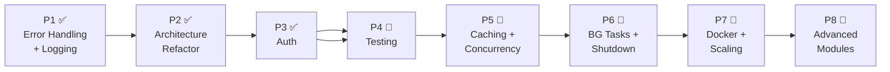

# Backend Engineering — 27-Module Implementation Plan

> **Project:** Smart Inventory Assistant (FastAPI + React + SQLite + LangGraph)
> **Architecture:** Modular Monolith
> **Last Scanned:** March 2026

---

## Full Module Audit (27 Modules)

### ✅ Core Backend Fundamentals (Modules 1–8)

| # | Module | Status | Evidence in Project |
|---|--------|--------|-------------------|
| 1 | **HTTP & Web** | ✅ Done | FastAPI handles HTTP natively. CORS configured in `main.py`. Health check endpoint exists. |
| 2 | **Routing & Path Ops** | ✅ Done | 4 route groups (`analytics`, `chat`, `inventory`, `requisition`), 20+ endpoints, prefix routing via `APIRouter`. |
| 3 | **JSON & Serialization** | ✅ Done | All endpoints return JSON. Pydantic `BaseModel` on all request/response bodies. `date` serialization handled. |
| 4 | **Auth & Authorization** | ✅ Done | JWT auth implemented with `python-jose`, password hashing with `passlib`, User model with roles (admin, manager, staff, viewer), `get_current_user` dependency, role-based access via `require_role`, `require_admin`, `require_manager`, `require_staff` decorators. |
| 5 | **Data Validation** | ✅ Done | Pydantic everywhere: `Field(ge=0)`, `min_length`, `max_length`, `pattern` regex on urgency. RequestValidationError handler. |
| 6 | **Architecture** | ✅ Done | Repository pattern (`inventory_repo.py`, `requisition_repo.py`), DI via `dependencies.py`, layered: routes → services → repos. |
| 7 | **API Design** | ✅ Partial | Consistent `{success, data}` shape, health check, `/docs` auto-generated. **Missing:** `response_model` on routes, API versioning, pagination on list endpoints. |
| 8 | **Databases & ORM** | ✅ Done | SQLAlchemy 2.0, 7 ORM models, `create_all()` auto-migration, `get_db` session factory, joinedload for N+1 prevention. |

### 🟡 Intermediate Backend (Modules 9–14)

| # | Module | Status | Evidence in Project |
|---|--------|--------|-------------------|
| 9 | **Caching** | 🔴 Not Started | No `cachetools`, no Redis, no LRU. Every request hits DB fresh. |
| 10 | **Task Queues** | 🔴 Not Started | No `BackgroundTasks`, no Celery. ChromaDB writes are synchronous (blocks response). |
| 11 | **Error Handling** | ✅ Done | 8 custom exceptions in `core/exceptions.py`. 3 global handlers in `error_handlers.py`. Zero `HTTPException` remaining. |
| 12 | **Config Management** | ✅ Done | Centralized `Settings` class in `config.py`, `.env` file, `python-dotenv`, env-based log levels. |
| 13 | **Logging & Observability** | ✅ Done | Structured logging (`logging_config.py`), request middleware with `X-Request-ID` + `X-Process-Time`, LangSmith integration for LLM tracing. |
| 14 | **Graceful Shutdown** | 🔴 Not Started | No `lifespan` context manager. No `engine.dispose()`. DB connections leak on Ctrl+C. |

### 🔴 Security & Performance (Modules 15–17)

| # | Module | Status | Evidence in Project |
|---|--------|--------|-------------------|
| 15 | **Backend Security** | 🔴 Not Started | No rate limiting, no security headers (`X-Content-Type-Options`, `X-Frame-Options`), CORS allows `*` methods. |
| 16 | **Scaling A** | 🟡 Partial | Request timing middleware exists (`X-Process-Time`). **Missing:** slow query logging, N+1 detection, DB connection pooling config. |
| 17 | **Scaling B** | 🔴 Not Started | Dockerfile is a placeholder (`alpine + sleep`). No multi-worker Uvicorn. No Gunicorn. Single-process only. |

### 🔴 Concurrency & Advanced Systems (Module 18)

| # | Module | Status | Evidence in Project |
|---|--------|--------|-------------------|
| 18 | **Concurrency** | 🔴 Not Started | All routes are `def` (sync). No `async def`. No connection pooling config. Default SQLite thread mode. |

### 🔴 Testing & Quality (Module 19)

| # | Module | Status | Evidence in Project |
|---|--------|--------|-------------------|
| 19 | **Testing** | 🔴 Not Started | Zero test files. No `pytest`, no `TestClient`, no `conftest.py`. No DI overrides for testing. **Big resume gap.** |

### 🔴 Cloud & Real-Time (Modules 20–22)

| # | Module | Status | Evidence in Project |
|---|--------|--------|-------------------|
| 20 | **Object Storage (S3)** | 🔴 Not Started | No file uploads to cloud. Audio files processed in-memory only. |
| 21 | **Real-Time (WebSockets)** | 🔴 Not Started | Chat is request-response only. No WebSocket endpoint. No real-time stock alerts. |
| 22 | **Webhooks** | 🔴 Not Started | No server-to-server callbacks. No HMAC verification. No idempotency keys. |

### 🔴 Search, Email & Documentation (Modules 23–25)

| # | Module | Status | Evidence in Project |
|---|--------|--------|-------------------|
| 23 | **Advanced Search** | 🔴 Not Started | No Elasticsearch. Search is basic SQL `LIKE`. ChromaDB is for AI memory, not user-facing search. |
| 24 | **Transactional Emails** | 🔴 Not Started | No email service. No SendGrid/SES. No notification on requisition status change. |
| 25 | **API Documentation** | ✅ Partial | Swagger UI works at `/docs`, auto-generated from routes. **Missing:** `response_model` on endpoints, explicit examples, ReDoc customization. |

### 🔴 Cloud-Native & DevOps (Modules 26–27)

| # | Module | Status | Evidence in Project |
|---|--------|--------|-------------------|
| 26 | **12-Factor App** | 🟡 Partial | Config from env ✅, stateless ✅. **Missing:** proper log streams, dev/prod parity, disposability. |
| 27 | **DevOps & Docker** | 🔴 Not Started | Dockerfile is placeholder. No multi-stage build. No `docker-compose.yml` services. No CI/CD. |

---

## Score Summary

```
✅ Done:        11/27 modules (41%)
🟡 Partial:      3/27 modules (11%)
🔴 Not Started: 13/27 modules (48%)
```

---

## Phased Implementation Roadmap

> Phases are ordered by **dependency chain**: each phase builds on the previous one.



| Phase | Modules | Status | Time | What You Get |
|-------|---------|--------|------|-------------|
| **P1** | 11 + 13 | ✅ Done | — | Custom exceptions, structured logging, request correlation |
| **P2** | 6 + 7 | ✅ Done | — | Repository pattern, DI, response schemas |
| **P3** | 4 | ✅ Done | ~3-4 hrs | JWT auth, User model, role-based access, auth routes |
| **P4** | 19 | 🔴 Next | ~2-3 hrs | Pytest suite, TestClient, fixture factories, DI overrides, ≥80% coverage |
| **P5** | 9 + 18 | 🔴 Planned | ~2-3 hrs | In-memory TTL cache, cache invalidation, connection pooling |
| **P6** | 10 + 14 | 🔴 Planned | ~2 hrs | BackgroundTasks, lifespan shutdown, resource cleanup |
| **P7** | 15 + 17 + 27 | 🔴 Planned | ~2-3 hrs | Rate limiting, security headers, Production Dockerfile, docker-compose, multi-worker, Gunicorn |
| **P8** | 20-26 | 🔴 Optional | ~4-6 hrs | WebSockets, webhooks, emails, S3, 12-factor, advanced search |

---

## 🎯 Resume Priority Guide — Backend Engineer Job Market

### 🔴 MUST-HAVE for Resume (Non-Negotiable)

These will be asked in **every** backend interview. Missing any = immediate red flag:

| Module | Why Interviewers Care | Your Status |
|--------|----------------------|-------------|
| **Auth (Module 4)** | "How does your app handle authentication?" is Q1 in every interview. JWT, password hashing, role-based middleware. | ✅ Done |
| **Testing (Module 19)** | "Show me your tests" — no tests = junior signal. Pytest + TestClient + ≥80% coverage. | 🔴 P4 |
| **Docker (Module 27)** | "Can you containerize this?" — expected baseline. Multi-stage Dockerfile + docker-compose. | 🔴 P7 |
| **Error Handling (Module 11)** | Custom exceptions, global handlers, no stack trace leaks. | ✅ Done |
| **Architecture (Module 6)** | Repository pattern, DI, layered architecture proves you think beyond CRUD. | ✅ Done |

### 🟡 STRONG DIFFERENTIATORS (Top 20% of candidates)

Adding even 2-3 of these makes your project stand out:

| Module | Why It Stands Out | Your Status |
|--------|------------------|-------------|
| **Caching (Module 9)** | Shows you understand performance at scale | 🔴 P5 |
| **Background Tasks (Module 10)** | Async processing is expected in production systems | 🔴 P6 |
| **WebSockets (Module 21)** | Real-time = modern. Live stock alerts via WebSocket is impressive. | 🔴 P8 |
| **Graceful Shutdown (Module 14)** | Shows production maturity. Most juniors skip this. | 🔴 P6 |
| **Rate Limiting (Module 15)** | Security awareness. Easy to implement, impressive to mention. | 🔴 P3 |

### 🟢 NICE-TO-HAVE (If Time Permits)

These are bonus points but won't make or break an application:

| Module | Notes |
|--------|-------|
| S3 / Object Storage (20) | Only if your project handles file uploads |
| Webhooks (22) | Impressive but niche |
| Elasticsearch (23) | Only for search-heavy apps |
| Transactional Emails (24) | Good but not core backend |
| 12-Factor App (26) | More of a philosophy checklist than code |

### 📊 Bottom Line

> **To be job-ready as a backend engineer, implement through Phase 7** (P1–P7).
> That gives you **19/27 modules** covering Auth, Testing, Docker, Caching, Background Tasks, and Scaling.
>
> **Minimum viable resume project**: Complete P1 → P2 → P3 → P4 → P7.
> That's 5 phases ≈ 12-15 hours of work and covers all the non-negotiable items.
>
> Your current progress: **P1 + P2 done** (10/27). You need ~3-4 more phases.

---

> **Interview tip:** When discussing this project, lead with architecture decisions ("I chose a modular monolith because..."), not features. Explain WHY you used the repository pattern, WHY you have custom exceptions, WHY you chose in-memory cache over Redis for this scale. That's what separates mid-level engineers from juniors.
